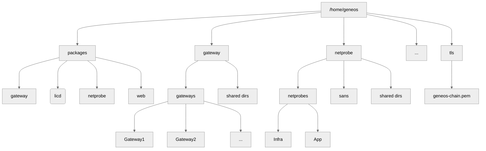

# Geneos Best Practice Installation Guide

> Version: v0.1.0
>
> Published: 2023-11-xx
>
> ✔ This guide was written using Geneos 6.5.0 and the cordial tools v1.10.4


## Introduction


Geneos is an established and mature enterprise monitoring platform.

This guide is written by the ITRS Professional Service team and contains our experiences over many years.

This guide describes how to install a Geneos system, how to name components 

The instructions here are not intended to be prescriptive and neither are they an attempt to describe the only way to do it.

Previous versions of this document ...

This guide assumes a traditional, non-containerised installation either in VMs or bare metal servers. For containers see xxx.


## Getting Started


The initial installation of Geneos can be quick and simple. Don't be discouraged by the volume of options, terminology and concepts. We have written these guides to make things as straight forward as possible.


### Geneos Demo System

The most basic Geneos system - running on a Linux VM or host or in a WSL session, consists of a Gateway, a Netprobe to collect data and an Active Console to view the state of the system. You can install a "demo" system without a licence file and be up and running in minutes. For this you do not need to create a special user account or locate an installation directory - the default is to use your account and create a `geneos` directory in your home area.

First, download and install the `geneos` utility, like this:

```bash
install here
```

Next, use the `geneos` utility to download and install the basic Geneos components and run them.

⚠ Note: You will need to have [registered for an account](https://www.itrsgroup.com/?register=1) to download the software packages directly to your Geneos server. If you cannot access our download site directly then you can also download the required packages and install from a local directory instead. See the [documentation](https://github.com/ITRS-Group/cordial/blob/main/tools/geneos/docs/geneos_init_demo.md) for more info for the `-A` option.

Then do this (and change the destination directory if you want to):

```bash
$ geneos init demo -C -u youremail@example.com
Geneos Directory (default "/home/geneos"): <RETURN>
Password: ********
```

This will create the Geneos directory structure, install template files, download and install packages and create a local certificate authority to sign certificates for each Geneos component you install. You will then see a Gateway, Netprobe and a Web Dashboard instance all running. The Gateway, which is where you will connect your Active Console to, listens on "secure" TCP port 7038 by default.

Make sure that this port is accessible from your desktop. This may involve a local host firewall (WSL should treat it as a local application port so no action is normally required) or having it opened for access by your networks team.

Finally, download and run the Active Console on your desktop. If you are running on Windows then you need to download the Windows ZIP file, extracts the contents and run the `ActiveConsole.exe` program.  Then so to Settings -> Connections and add a connection to the host running your Gateway:

(screenshot here)

⚠ Note: A Geneos "demo" system doesn't require a licence file but is subject to a number of restrictions. You can [read more here](https://devdocs.itrsgroup.com/docs/geneos/current/Gateway_Reference_Guide/gateway_licensing.htm#DemoMode).

### Geneos For Real

Once you have experienced the basic functionality of Geneos through a demo system it's time to plan and install Geneos for real. For this you will need to plan where the various components will be installed, the connectivity between them and also have a valid licence file.


Checklist:


* Prepare system(s)
    * Prerequisites
    * User account
    * Install directory
    * Licencing

* Plan
    * Initial components
    * Naming
    * Netprobes
        * Normal
        * SANs
    * Network Access
    * Shared Configuration
    * Authentication
    * Secure Communications / Certificates

* Download `geneos`
    * Install
    * Initialise
    * Deploy

* Desktop Access
    * Active Console


## Installation Environment

### User Accounts

You should create a new user account for Geneos. All the steps in this guide should be performed as that user. As normal for UNIX/Linux user accounts there should also be a similarly named group.

This account should be available across all systems that Geneos will monitor with the same numeric IDs for the user and group.

We will use the account name `geneos` throughout this guide in directory listings etc.

If you are deploying Netprobes on Windows systems then you should review the requirements for access before implementing any new account for the Windows Service which normally runs as `Local System`.

```bash
$ sudo useradd -m geneos
```

### Choosing the Geneos Directory

All the Geneos software, configuration and any persistent files are stored in a unified directory tree. The choice of this location will be influenced by you organisation's policies and standards. Typical locations may be `/opt/itrs`, `/opt/geneos` or `/home/geneos`. We will use the last one throughout this guide.

The typical Geneos installation will contain a `packages` directory for the downloaded software, one directory for each component type and if you are using Secure Communications, as recommended, a `tls` directory. It may start with a layout like this:



We will explore the contents of each directory throughout the rest of this guide.

### Network Access

Geneos components communicate using TCP/IP (IPv4 only). By default all components will listen on a configured port. The default ports are listed below:

Geneos Component | TCP Port | Description
---------|----------|---------
 Gateway | 7039 | Default insecure port
 &nbsp; | 7038 | Default secure port
 Netprobe | 7036 | Default port [^1]
 License Daemon | 7041 | Default port
 Web Server | 8080 | Default insecure port
 &nbsp; | 8443 | Default secure port (?)
 Active Console | 7040 | Default diagnostic port

[^1]: Self-Announcing Netprobes require a port number to be configured for identity purposes in the Gateway, but can be set to not open a listening port.

These ports, or whichever you choose to use, should be opened for access through any server or network firewall to the systems that will host each component type.

⚠ Note: If you plan to use Database Logging then you must also ensure that both your Gateways and all user's Active Consoles have direct access to the database server. Database queries from the Active Console are made directly and not via the Gateway.


### Download and Install `geneos`

Download the latest version of the [`geneos`](https://github.com/ITRS-Group/cordial/tree/main/tools/geneos) utility from the [`cordial`](https://github.com/ITRS-Group/cordial) repo:

```bash
cd /tmp
wget https://github.com/ITRS-Group/cordial/releases/latest/download/geneos
chmod +x geneos
sudo mv geneos /usr/local/bin/
hash -r
```

or, if your system doesn't have `wget`

```bash
cd /tmp
curl -OL wget https://github.com/ITRS-Group/cordial/releases/latest/download/geneos
chmod +x geneos
sudo mv geneos /usr/local/bin/
hash -r
```

The `hash -r` will discard the path search cache to ensure that `geneos` will be found when you try to run; This assumes you have `/usr/local/bin` in your `PATH`.

You can test by checking the version:

```bash
$ geneos version
geneos version v1.8.0
```

The version at the link above will work for most users but is statically linked so cannot load shared libraries required if your user accounts are in a directory such as LDAP or AD. In this case please see the release for alternative binary downloads.

### Create The Initial Geneos Environment

You can set-up a typical basic Geneos environment like this:

1. To download software releases with Internet access, with a license file `geneos.lic`:

    ```bash
    geneos init all -C -L geneos.lic -u email@example.com -l
    ```

2. Without direct Internet access you will have to download the release archives and place them in a local directory:

    ```bash
    geneos init all -C -L geneos.lic -A /tmp -l
    ```

For the `geneos init all` command you will need to download the following releases archives:

* Gateway
* Netprobe
* Licence Daemon
* Web Server
* (optional) Active Console 2 for Linux


# Naming Components

Gateway

Business Unit / LOB
Application
Environment - Prod, Dev etc.
Instance number

Netprobe

Hostname '_' Port

Webserver / Webslinger follows Gateway + port


### Start-up and Shutdown


