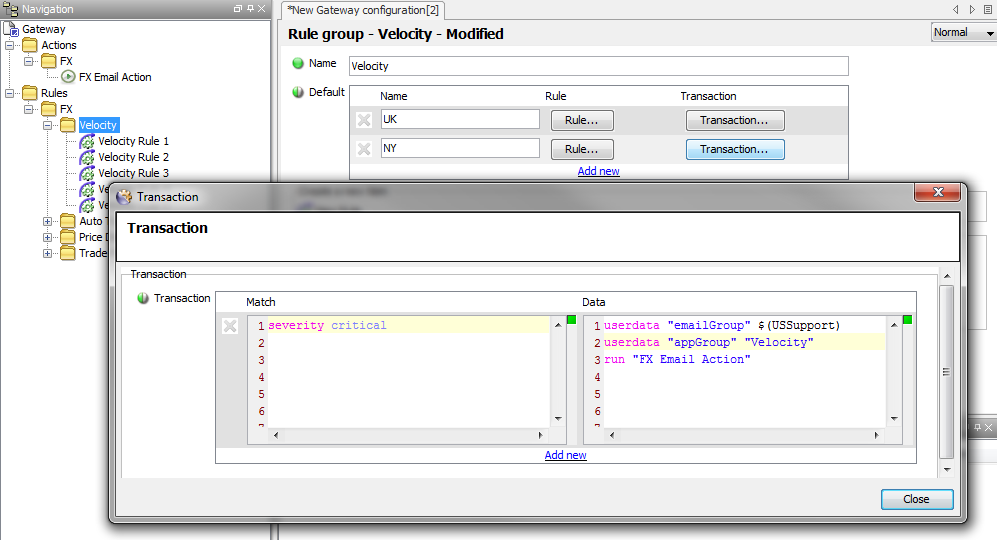

# Gateway Best Practice Guide

> Version 2.1
> 
> **30 July 2014**

## Document Controls

### Revision History

Version | Date | Author | Notes
---------|----------|---------|--------
 1.0 | 19/04/13 | JH | Initial Version
 1.1 | 29/07/14 | JH | Copy to new company template

## Introduction

### Purpose

The purpose of this document is to indicate the agreed standards for Geneos Gateway Configuration that represent ITRS best practices and which are able to be implemented ITRS Professional Services and Support staff.

The document will detail implementation standards for:

* Main/Include File Usage
* Attribute Structure and Naming
* Group Structures for Common Sections (Types/Samples/Sampler Includes etc.)
* Authentication
* Alerting
* Actions
* Principles of Overriding Default Configuration

These standards are not meant as prescriptive configuration instructions, but as the basis for implementing best practice standards in conjunction with the client’s specific and often very individual requirements.

### Audience

These standards are to be used by ITRS Professional Services when creating initial deployments, carrying out reviews of existing client environments and enhancing existing client environments and also by ITRS Support staff when supporting client environments.

The standards should also be of interest to ITRS Pre-Sales staff.

Although this is primarily an internal document, the information is also relevant to any client who is willing and able to manage their own environment (this is the majority of our clients), especially where that environment has been created using ITRS Global Standards.

### Background

Historically, Gateways have not been installed in a consistent manner and clients have generally used their own methods for installing and administering their Gateway environment.

It is thought that by providing best practices for Gateway configuration, it is possible to greatly increase the efficiency with which Gateways are introduced into environments and also to provide a consistency that makes the administration and support of Gateways a more straightforward task.

The details in this document are the result of the accumulated experience of the Professional Services department implementing Geneos environments for many different clients and are thought to provide the most reliable solution in terms of maintenance and scalability.

## Implementation Standards

These Best Practice Standards are intended to be used in conjunction with the *Gateway Installation Template* and the *Professional Services Gateway Installation Guide*.

Once a Gateway environment has been created using the above, these standards enable Gateway configuration to be carried out in a manner that ensures the incorporation of best practices.

### Main/include File Usage

Include files allow both separation and reuse of configuration data.

The ITRS Gateway Template contains standardised Include Files for initial use. These are detailed in the *Professional Services Gateway Installation Guide*.

Use of Include Files will lead to a limited set of configuration settings in the Main Gateway file:

* Include Files
* Probes
* Managed Entities
* Gateway Level Alerting (if required)
* Operating Environment
* Any changes from the `GLOBAL_Infrastructure`, `GLOBAL_Administration` and any shared Application Include files

Additional Include files should be created in consultation with the client.

#### Include File Usage

If the monitoring of applications is (or likely to be) shared between Gateways, then Include files should be used.

If the monitoring of applications is not shared then it is a matter of choice to use Include files or not. The main reasons for adopting the use of Include files in this case are:

* To provide separation and clarity of configuration
* To provide separation of administrative responsibility

The naming and configuration of additional Include files is dependent on how they are going to be used.

Most monitoring is required on an application basis. However, responsibility for the administration of the monitoring might either belong to a separate team from the Application Support Team or it might be shared between teams. It is therefore important to decide if the Include files should be support-based or application-based.

Usually, if the Application Support Team are responsible for administering any part of the configuration (i.e. Rules), it is advisable to have separate Include files on an Application or Application Support Team basis, otherwise the Administration team can decide how the Include files should be divided.

#### Include File Disadvantages

Although the use of Include Files can have create advantages for the administration of Gateways, it should be noted that there are also disadvantages to using Include Files, especially in large numbers and the over use of Include Files should be discouraged.

Large number of Include Files can increase the time taken to save the configuration after changes to a level that adds unnecessary delays to the administration process.

Large number of Include Files can often hinder rather than help the administration process by making it difficult or uncertain where to add specific configuration elements. This can often lead to less experienced administrations placing configuration items in incorrect Include Files, making later administration of these elements even harder.

As a rule of thumb, the number of Include Files is recommended to stay within single figures.

#### Include File Naming and Priorities

The naming of the Include files should reflect both the application or group for which they are intended and also the scope of the monitoring, i.e. `GLOBAL_<AppName>`, `EMEA_<SupportGroupName>` etc.

Priorities of Include Files should be based on the _distance_ of the Include File from the main Gateway file, for example:

* Main file 1
* `Authentication`/`Administration` 2 - 9
* Department/Group 10 - 99
* Country 100 - 999
* Region 1,000 – 9,999
* Global 10,000

In this example list, an `Authentication` or `Administration` Include file would be used to hold anything that needs to be applied local or globally, but which is administratively sensitive (e.g. various Commands or Authentication), the settings of which should not be able to be overwritten by other Include Files.

Authentication can either be a separate Include File or can be incorporated into any other level Include File using appropriate section authentication.

The `GLOBAL_Administration` Include file would contain Default Commands, Actions, Effects etc., which can be overwritten.

#### Include File Rule Priorities

It is also good practice for any Rules that exist in the Include Files to have a top-level Default Rule Group configured and have the Rule Group Priority set to the same as the Include File Priority.

Include File and Main File usage should be configured only after the requirement has been clarified with the client and the appropriate Gateway Architecture Guide document has been produced.

### Attribute Structure and Naming

To achieve the highest level of Business Information it is necessary to ensure data can be shared and overviews made across all organisational divisions.

The use of Attributes enables a consistent information structure to be created between all Gateways in an organisation and allows meaningful reporting across all divisions.

There are three main elements to an Attribute structure:

* **Location-specific Attributes** that define where the system on which monitored values resides
* **Environment Attributes** that define the environment for the monitored values
* **Descriptive Attributes** that indicate the nature of the monitored values

It is up to the client to decide how many Attributes they use, but these should always be in line with any requirements they have (including future requirements) for their agreed level of Monitoring Maturity.

#### Location Attributes

It should be possible for a client using any combination of Location Attributes to provide the necessary location information for a Managed Entity.

Location Attributes should be none or any of `REGION`, `COUNTRY`, `LOCATION` and `DATACENTRE`.

It is important to stress that it is not necessary to use all of the Location Attributes, but it should be possible using a combination of these to be able to describe the vast majority of locations that are likely to be met.

#### Environment Attributes

Environment Attributes place the monitored values in a specific working environment and should be none or any of `DEPARTMENT` and `ENVIRONMENT`.

#### Descriptive Attributes

The Descriptive Attributes are the key Attributes in terms of defining the type of data that are being monitored.

How these Attributes are used varies a great deal on the size and structure of the monitoring requirement.

More than any other Attributes, the Descriptive Attributes provide the relevant separation of the underlying data into meaningful groups across an entire organisation. This structure can then be used not only to display the data in a relevant manner within the Active Console, but also to allow separation of data for use with Rules, Commands, Database Logging etc.

These Attributes are often configured to describe the exact nature of the data for which they are intended; `APPLICATION`, `COMPONENT`, `INFRASTRUCTURE`, OS etc. These can be thought of as ‘Meaningful Descriptive Attributes’.

However, there are sometimes occasions when it is better to use names that to not describe the nature of the data, but which can be re-used for all types of data. These can be thought of as ‘Agnostic Descriptive Attributes’.

Both types of Descriptive Attributes are described below, showing the advantages and disadvantages of using each and also the occasions when one might be used over the other.

##### Meaningful Descriptive Attributes

If Meaningful Descriptive Attributes are being used, these can take any form that makes sense to the client and provides the relevant organisational structure for the data.

Most usually these would be `APPLICATION`, `COMPONENT` and `SUB-COMPONENT` for application data and `INFRASTRUCTURE`, `OS`, `NETWORK` etc. for infrastructure data.

Gateway and Dashboard data would be identified by using `GATEWAY` and `DASHBOARD` Attributes.

**<u>Advantages</u>**

The advantage of using meaningful descriptive names is that they are easy to understand and allow simple selection within the Path Editor (i.e. it is obvious what is being selected) and ViewPath.

**<u>Disadvantages</u>**

The disadvantages are that unless strict procedures are put in place, it is very easy for administrators to create more and more Attributes to describe the growing and changing monitoring environment. This can eventually add complexity to any selection process that outweighs the usefulness of using meaningful names.

Each time a new Attribute is created, those people needing to use the Attribute as a sorting factor within the Active Console need to be informed and have to modify their ViewPath.

With no set structure in place it is comparatively easy for different administrators to create different Attributes that actually describe the same data, making this data harder to use for statistical or viewing purposes.

**<u>When to Use</u>**

Meaningful descriptive Attributes have the greatest advantage when used in small systems that do not form part of any cross-department data gathering.

Also, when existing systems already use these and conversion to agnostic descriptive Attributes is not a feasible option.

**<u>When Not to Use</u>**

Where a high degree of organisation structure is required across business lines and areas of administrative operation it is only advisable to use meaningful descriptive Attributes in conjunction with a strict set of naming standards for the Attributes. For example, only use uppercase names and provide a list of all available Attribute names to all Administrative groups.

**<u>Example Use of Meaningful Descriptive Attributes</u>**

The following Attributes and settings illustrate how these Attributes might be used.

* Application Data: `APPLICATION`, `COMPONENT`, `SUB-COMPONENT`
* Infrastructure Data: `INFRASTRUCTURE`, `INFRASTRUCTURE-TYPE`, `HARDWARE-TYPE` (`OS`), `MIDDLEWARE-TYPE`
* Gateway Data: `GATEWAY`, `GATEWAY-DATA`

**N.B.** The top level divisions for Infrastructure and Gateway are only necessary to create clear divisions at the same level as the `APPLICATION` Attribute and can be ignored if not required.

This would create a State Tree view similar to the following:

The ‘FX’ `APPLICATION` Attribute has `COMPONENT` Attributes for the different application components (Auto Trader, Velocity etc.) and then further divisions using the `SUB-COMPONENT` Attribute for the individual application sub-components.
 
To create an ‘Infrastructure’ division at the same level as the ‘FX’ `APPLICATION` it would be necessary to add ‘Infrastructure’ as a separate `INFRASTRUCTURE` Attribute. ‘Hardware’ and ‘Middleware’ would then be `INFRASTRUCTURE-TYPE` Attributes. The ‘Hardware’ division would have a further division using the HARDWARE-TYPE or OS Attribute and the ‘Middleware’ division would have further division of `MIDDLEWARE-TYPE`.
 
If the ‘Infrastructure’ division was not needed (i.e. because there was only hardware being monitored), the primary division would be ‘hardware’, configured as either an `INFRASTRUCTURE` Attribute (it is important that this division existed to separate it from the Application data).
 
Like ‘Infrastructure’, the Gateway data is a separate division, either as a separate single `GATEWAY` Attribute, or as a `GATEWAY` Attribute with further sub-divisions of ‘Gateway Stats’, ‘Gateway Load’ using the `GATEWAY-DATA` Attribute.

##### Agnostic Descriptive Attributes

If Agnostic Descriptive Attributes are being used, they should be one or both of `CATEGORY` and `COMPONENT`.

The reason for using agnostic names is to provide a simple structure that is capable of displaying different types of data in an ordered manner, similar to the way in which ‘genus’ and ‘species’ are used to categorise plants and animals.

This is particularly important within large organisation where visualisation and reporting are required across multiple or all divisions.

**<u>Advantages</u>**

The advantage of using agnostics Attributes is that the number of Attribute used is kept to a minimum.

It also means that once a ‘ViewPath’ in the Active Console has been configured, there is no further requirement to make changes to it. Any additions to the configuration will automatically appear in the structure.

**<u>Disadvantages</u>**

The main disadvantage is that the two agnostic Attributes contain all of the different data elements is that makes it slightly harder to select relevant Attribute types within the Path Editor. Although the number of Attributes within the Managed Entity element of the Path Editor is reduced and kept to a minimum, the actual number of entries in the `COMPONENT` Attribute can be quite large, as this includes all Application, Infrastructure and Gateway `COMPONENT`s.

This style of configuration is also a little harder to grasp than using meaningful descriptive Attributes.

**<u>When to Use</u>**

It is general a good idea to use agnostic descriptive Attributes in Greenfield sites.

There use is highly recommended where a high degree of organisation structure is required across business lines and areas of administrative operation.

**<u>When Not to Use</u>**

Agnostic descriptive Attributes should not be used where clients show a clear preference for using meaningful descriptive Attributes.

It is also not advisable to use these where existing systems already use meaningful descriptive Attributes in an extensive manner.

**<u>Example Use of Agnostic Descriptive Attributes</u>**

There will probably only be a limited number of `CATEGORY` Attributes used:

Value | Description
---------|----------|
| Gateway | This `CATEGORY` contains all Gateway data
| Infrastructure | This `CATEGORY` contains all infrastructure data
| Dashboard | This `CATEGORY` contains all Dashboard data
| Descriptive | This `CATEGORY` is defined by the client and is the top-level descriptive element for the data monitored by the Gateway. This is most likely to be a business line or an application group, e.g. FX, Equities, etc.

**N.B.** it is important that the same type of division, e.g. business line, application group etc., is used across every gateway within the organisation that will be viewed or reported on together.

`COMPONENT` Attributes therefore are the elements that make up the specific CATEGORY. For example:

The `CATEGORY` ‘FX’ might have `COMPONENT` Attributes of ‘Auto Trader’, ‘Price Distribution’, ‘Velocity’ etc. The `CATEGORY` ‘Infrastructure’ might have `COMPONENT` Attributes of ‘Hardware’ and ‘Middleware’.

It is not anticipated that there should ever be a need for more than one level of CATEGORY; however there will often be a need for more than one level of `COMPONENT`. If more levels are required, it will be necessary to use `SUB-COMPONENT`, `SUB-COMPONENT2` etc.

Once these Attributes have been configured, setting the Viewpath in the Active console to include `CATEGORY`, `COMPONENT` and `SUB-COMPONENT` will provide data separation at consistent levels for ALL data.

For the client defined `CATEGORY` (e.g. FX), the `COMPONENT`s will be each specific Application or Application Group that makes up the `CATEGORY`, with further divisions being created using `SUB-COMPONENT` etc. where necessary

For the ‘Infrastructure’ `CATEGORY`, the `COMPONENT`s might be ‘Linux’, ‘Solaris’ and ‘Windows’ if only hardware infrastructure is monitored, or they might be ‘Hardware’ and ‘Middleware’, with further divisions for each infrastructure type using `SUB-COMPONENT`

For the ‘Gateway’ `CATEGORY`, the `COMPONENT`s might be ‘Gateway Stats’, ‘Gateway Load’ etc.

#### Exceptions

The structures described cannot accommodate every type of requirement from clients, but it is likely that the majority of requirements can be covered by using this model.

For example: If there is a requirement to view Infrastructure data *beneath* Application data in order that there is an obvious link in the Active Console between these two elements, then using agnostic descriptive Attributes, it is not possible for Infrastructure to be at the `CATEGORY` level and it must be moved to the `COMPONENT` level.

As with everything in the Best Practice Guide, it is more important that standards are understood and used by everyone in the organisation than what those exact standards are.

### Group Structure for Common Sections

Good group structure in the most used sections of the Gateway configuration makes configuration elements easier to find and also helps to reduce duplication.

With the exception of Probes and Rules, the groups for all of the sections mentioned below are logical groupings only and do not carry configuration: the primary function they offer is one of clarity.

The proposed groupings that follow are guidelines only. It is more important that groupings are used in some form or other rather than what these groupings are named.

As a good rule of thumb, following the `COMPONENT` level structure of the Managed Entities will, in most cases, provide a structure that creates a good level of understanding and ease of administration and in the examples that follow (apart from Probes), the primary grouping is by `COMPONENT`.

It is generally more useful if the Groupings match within Types, Samplers and Rules, but this is not always possible.

The examples shown below are from a system with multiple applications containing a large number of Toolkits, requiring a high level of organisation.

#### Probes

Probes are usually unrelated to application monitoring groups, as there is often more than one application per probe or more than one probe per application (or both).

It is therefore better to group Probes by Environment and Operating System, or Location and Department; whatever provides the greatest amount of flexibility over all of the probes.

#### Types

For Types, there is often no need to use more than 1 level of grouping and it is usually a matter of choice when to create extra levels. However, sub-groups should always be used where extra clarity can be achieved.

If Types are representative of the Dataview grouping to which the underlying Samplers belong, they should be named accordingly, as this makes the relationship between Type and Dataview obvious and also indicates clearly what each Type will contain.

#### Samplers

As the purpose of the group structure is to provide clarity to large numbers of items in order to make administration easier, it is not always possible or desirable to follow exactly the same standards.

Although the first-level grouping for Samplers should always be the chosen primary group (e.g. Application), the sub-groups used will be dictated by the number of Samplers involved.

Sometimes it will be relevant to apply further groups by Sub-Group and then by Plugin Name and/or Type. At other times it will be relevant to apply further grouping by Plugin Name and then by Sub-Group.

This example shows grouping by:

Application – Sub-Application – Plugin Name

Here it is assumed that sub-application FWATCH will contain monitoring that uses Samplers other than FTM

Here, OTC only uses a limited number of Toolkits and only requires grouping by:

**Application – Plugin Name**

However, in GP, due to the number of Toolkits used, it is necessary to provide further groupings after the Plugin Name:

**Application – Plugin Name – Sub-Application – Type**

Because the Type has taken the name of the Dataview and is duplicated here, it adds to the clarity and makes Samplers easier to find by association to the relevant Dataview.

#### Sampler Includes

Sampler Includes should be grouped by the same primary grouping as Types and Samplers (and sub-group if required) and then by the Sampler type, i.e. Logs, Disks, Processes, Services.

It is personal preference whether ‘Logs’ or ‘FKM’ are used for FKM Sampler Include Grouping

#### Static Variables

Static Variable sections should be grouped by the same primary grouping as Types and Samplers (and sub-group if required)

#### Rules

The Rules section should be grouped by the same primary grouping as Types and Samplers (and sub-group if required) where possible.

**N.B.** when using a large Rule Group structure extra care needs to be taken if using any Default settings in the Rule Group. These should not be applied to more than one level of the structure as they do not obey any hierarchy and each Default setting creates an independent set of Rules based on the Context.

### Authentication

Some basic standards for using Geneos Authentication are:

* Setting permissions in User configuration should be discouraged except for those cases where to do otherwise would create unnecessary administration
* Adding Users to Roles should be discouraged
* The use of User Groups should be encouraged as they add clarity, reduce administration and are more flexible.
* Initially, an Administrators Role and an Administrators User Group should be created, the Administrators Role added to the User Group Settings and the current administrative user added to the User Group
* Where there is a one to one relationship between a Role and a User Group, the User Group should have the same name as the Role
* Where there is a many to one relationship between Roles and a User Group, the User Group should have a name that describes the combined Roles
* If Alerting is to be used, group email addresses should be encouraged where possible that are then assigned to the relevant Roles so as to avoid unnecessary administration by having to add email addresses for every user

### Using Actions or Alerting

It is often not clear whether a client should be using Actions or Alerting to trigger alerts, although using both Actions and Alerting within the same environment should be discouraged.

The main difference between Alerting and Rules is that Alerting is triggered on severity changes only and Actions within Rules are triggered on whatever cell parameter is used to create a Rule transaction.

Baring that in mind, the following sections describe the various advantages and disadvantages of using either Actions or Alerting and also occasions where one should be used in preference to the other.

#### Actions

**<u>Advantages</u>**

Actions are easy to setup and can be configured to run against individual Rules.

Actions and especially scripted actions give the user greater flexibility in formatting their e-mails. For instance, it is possible to create HTML emails that provide colour indicators, or more complex scripts can be written that send both email and SMS messages.

An example email Action script can be found here.

If the Action requires additional data, UserData can be used to provide this to the underlying script.

Using Rule Groups, Defaults can easily be set up for all Rules within the Rule Group if required.

Using Rule Groups, it is a straightforward matter to provide different settings for Actions, e.g. different Active Times based on Location Attribute settings or different UserData based on a number of Attribute settings.

**<u>Disadvantages</u>**

In large configurations, Actions can end up being replicated in numerous places within the configuration. This can complicate the administration process when changes are required; especially if UserData is also used repeatedly to provide data to the Action and these also need changing.

It is not always possible to create Rule Groups in a structure that is relevant to the way in which Actions are required and this leads to the overuse and replication of Actions throughout the configuration.

There are often instances where the use of Include Files creates issues with Actions. For example; if Actions are configured within Regional Include Files, but the Rule is configured within a Global Include File, it is necessary to ensure that there is a copy of the Action in every Regional Include File where the Global Include File is also used, even if the Region does not require the Action.

**<u>When to Use</u>**

It is always necessary to use Actions if there is a clear requirement to use UserData to provide input to Actions.

It is always necessary to use Actions if complex Rule behaviour is required, e.g. performing different Actions for different call values.

It is always necessary to use Actions if there is a requirement to use a number of different Active Times within a specific area, i.e. any area that would naturally become an Alerting Hierarchy.

It is usually preferable to use Actions if there is only a limited and specific use case, i.e. not all FKM errors, not all process errors, only specific errors within Samplers, etc.

It is often preferable to use Actions in complex environments where the alerting protocol has no clear structure. However, this should only be considered after consultation has established that the requirement could not be accomplished using an Alerting structure

**<u>When Not to Use</u>**

The only instance where Actions should definitely not be used is where the structural nature of Alerting clearly offers a simpler and more efficient configuration method. This can be particularly relevant where Include Files are being used.

If multiple levels of Rule Groups are being used, the use of Defaults can be problematic and should be treated with care. In these instances it is sometimes preferably to use Alerting.

To decide what might constitute a simple and more efficient configuration method it is necessary to understand the advantages of using Alerting as described below.

**<u>Example Use of Actions</u>**

Here is a simple example of Default settings for a Rule Group ‘Velocity’ that required the use of UserData:

#### Alerting

**<u>Advantages</u>**

Alerting is simple to understand and is independent of Rules.

Alerting reduces the load on the Rule engine and is generally more efficient than running Actions in Rules.

For simple email messages, the defaults provided in the libemail.so library reduce the configuration required in Alerting as there is no need to provide the _TO address, which it takes from the Authentication specified.

It is straightforward to set up Alerting for a client based on clear requirements: i.e. All critical alerts for anything in Development go to ‘Team A’; All alerts for COMPONENTS ‘A’ and ‘B’ in CATEGORY ‘X’ go to ‘Team B’ etc.

Alerting prevents heavy configuration load sometimes required to maintain Actions within Rules.

Alerting prevents any problems related to the use of Include Files.

**<u>Disadvantages</u>**

Although Alerting is simple to understand, it can grow to become highly complex and difficult to administer.

With the Alerting hierarchy it is only possible to set Active Times at the top Hierarchy level.

**<u>When to Use</u>**

Because Alerting is often advantageous to use both in simple start-up configurations and more complex configurations, it is usually good practice to introduce Alerting as the first option for clients.

It is always preferable to use Alerting where there are clear requirements from the client that are able to be fulfilled using Alerting, such as those mentioned in the Advantages section above.

**<u>When Not to Use</u>**

Alerting cannot be used where there is a clear requirement to use UserData to provide input to Actions.

Alerting cannot be used where there is a requirement to use a number of different Active Times within an Alerting hierarchy.

Alerting should not be used where there is a requirement for simple, specific Action use within Rules.

**<u>Example Use of Alerting</u>**

There is a small, example Alerting structure configured with the Gateway Template. The use of Alerting will obviously vary greatly between clients, so again it is more important to ensure that the client has full knowledge and understanding and is able to create an Alerting structure relevant to their organisation.

It is often a good idea to create a separate Alerting Hierarchy for each support group, although it is possible to create a single Hierarchy and create relevant divisions within this.

Support groups can be spread across multiple applications within a Gateway, or support groups can be on a single application basis. The determining factor that dictates whether single of multiple hierarchies need to be used is whether all support groups will use the same hierarchy division types. For instance:

* An infrastructure support group might need:
  * ‘Managed Entity Attribute (`LOCATION`)’
  * ‘Sampler Type’
  * ‘Plugin Name’
* An application support group might need:
  * ‘Managed Entity Attribute (`COMPONENT`)’
  * ‘Managed Entity Attribute (`SUB-COMPONENT`)’
  * ‘Sampler Name’

It is also important to determine if the client has a requirement to pass any information to the controlling scripts that rely on the use of _userdata_, as this will dictate whether Alerting or Rule-based Actions are used.

As there is a strong link between Alerting Hierarchies and the Authentication Roles, it is a good idea to plan both Alerting and Authentication at the same time.

### Principals of Overriding Shared Configuration

Is it to be expected that after a period of time the various groups that are using a shared piece of configuration will require to have exceptions to that configuration that relate to their own specific environment.

In nearly all cases that use it, shared configuration is updated as a standalone piece of configuration on a regular basis and it is not good practice to included elements in the shared configuration that override specific elements for specific uses.

Therefore it is necessary to place any exceptions in the Main Gateway file for the specific environment that requires them.

As the Main Gateway file and the Default Rule Group within it will have the highest priority this will ensure that the exception configuration and Rules in the Main file will have precedence over the standard configuration in the Include File.

### Gateway Naming Convention

If the client is not tied to any pre-existing naming standards for Gateways, the following naming standards should be offered:

| Part | Usage | Example
---------|----------|---------
| Monitoring Scope | The extent of the monitoring environment, i.e. UK, FR, US etc. | UK
| Gateway Location | Where the Gateway is located, i.e. London, Paris, New York etc. | LDN
| Department | The department who own the Gateway, i.e. FX GLobal , Equities, etc. | FXGBL
| Application | The application being monitored, i.e. AutoTrade, Velocity, Fidessa, etc. | AT
| Environment | The application environment, i.e. P for Prod, U for UAT etc. | P
| Ordinal | The instance number of this type of Gateway, i.e. 01, 02 etc. | 01

For example: UK_LDN_FXGBL_AT_P01

Using each element of the naming standards in this way might not always make sense for the client’s environment and they might not always want to make use of every element, but it is important to ensure that whatever standards are agreed upon are suitable for all Gateways within the organisation.

***N.B.** If a Gateway name contains a dot, the Gateway will be ignored by the Gateway script and it is not possible to create a Gateway (using the Gateway script) that contains a dot.

*This allows clients to manually create backup versions of Gateways by making copies where the name does contain a dot, i.e. UK_LDN_FXGBL_AT_P01.bck, without affecting the day to day administration of the Gateways using the Gateway script.*

## Summary

The use of these Best Practices will, in most cases, lead to configuration that is both more robust and easier to administer.

However, it is important to remember that these standards are not meant as prescriptive configuration instructions, but as the basis for implementing best practice standards in conjunction with the client’s specific and often very individual requirements.

To summarise the steps required:

* In conjunction with the client, work out a Gateway naming convention and install the required gateways in accordance with the _Gateway Installation Guide_
* If there is no Gateway Architecture Guide document provided by a Solution Design document from which to create the Include File and Main File structure, create this for the client
* In conjunction with the client, decide whether to use ‘Descriptive’ or ‘Meaningful’ Attributes and work out the Managed Entity Group and Attribute structure. This should be based on the existing requirement for Infrastructure and Application monitoring plus the client’s additional requirements for location and environmental divisions
* Ensure that a relevant group structure exists for all required configuration sections
* In conjunction with the client, work out the authentication requirement and configure the Role and UserGroup Structure
* In conjunction with the client decide whether to use Actions or Alerts and create the necessary Alerting Structure or Rule Group structure as required
* Ensure that the client understands all of the principals used and that sufficient knowledge transfer is undertaken to enable the client to add to and modify the configuration as required

