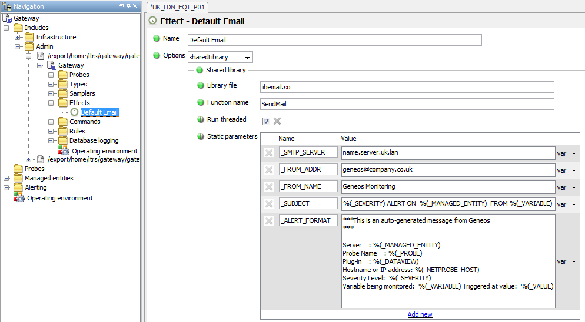
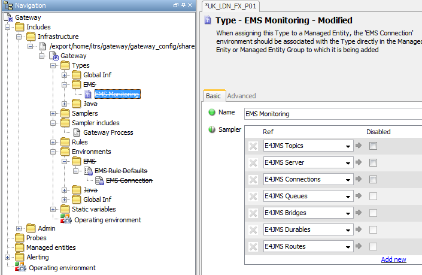

# Gateway Installation and Maintenance Guide

> Version 2.2

## Document Controls

### Revision History


Version | Date | Author | Notes
---------|----------|---------|--------
 1.0 | 30/03/13 | JH | Initial Version
 2.0 | 19/04/13 | JH | After initial reviews
 2.1 | 29/07/14 | JH | Copy to new company template
 2.2 | 02/07/20 | LC | Clarification on licd and netprobe in installation directory structures


## Introduction

### Purpose

This document provides an explanation of the Gateway installation template and procedures for the implementation of standard Gateway installations.

An environment created using the Gateway template and following the procedures described here will allow the creation and administration of multiple Gateways in a controlled and manageable way.

The document also details the use of the include files that are provided by the Gateway template and shows how these can be implemented by ITRS Professional Services, ITRS Support and by clients to simplify the initial Gateway configuration process.

### Audience

The document is intended to be used by ITRS Professional Services and Support personnel as a guideline for new installations. It is not intended as a de-facto implementation plan and it is expected that customer discussions will often result in a different solution being implemented to the one described here.

#### Background

Historically, Gateways have not been installed in a consistent manner and clients have generally used their own methods for installing and administering their Gateway environment.

It is thought that by providing a templated environment, both for the underlying Gateway structure and for the initial Gateway configuration, it is possible to greatly increase the efficiency with which Gateways are introduced into environments and also to provide a consistency that makes the administration and support of Gateways a more straightforward task.

As well as helping both the client and ITRS to support Gateways, this approach also becomes highly important as ITRS take on more managed solutions.

The details in this document are the result of the accumulated experience of the Professional Services department implementing Geneos environments for many different clients and are thought to provide the most reliable solution in terms of maintenance and scalability.

Although this implementation guide was created predominantly to provide a repeatable, scalable solution for large Geneos deployments, it is still applicable to single Gateway installations from the point of view of support and also the client`s need to expand in due course and we would recommend following this guide for all installations.

## Implementation Steps

The following steps should be taken when implementing Gateway deployments:

1.  [Create Base Directory](#base-directory)
2.  [Install Gateway Template](#gateway-template-installation)
3.  [Install Software Binaries](#gateway-binary-installation)
4.  [Agree Gateway Naming Standards](#gateway-naming-standards)
5.  [Edit Gateway Configuration File as Required](#gateway-control-rc-file-details)
6.  [Create Gateway(s)](#gateway-script-create-functionality)
7.  [Edit Include Files as Required](#include-file-implementation)
    (including the removal of any unused sections, EMS, JVM, Alerting etc.)
8.  [Add Additional Include Files as Required](#adding-additional-include-files)
9.  Apply Best Practices to the Gateway Configuration

## Gateway Implementation

### Installation

#### Base Directory

Select a suitable ITRS home directory for all ITRS binaries and installations, such as /opt/itrs or /usr/local/itrs.

#### Gateway Template Installation

The GatewayInstallTemplate.tar file will install the following directory structure.


Note: netprobe and web (webserver) directories are used when installing those Geneos components on the same host and are not considered part of this guide. Often, the licd (Licence Daemon) is installed on the same host as the Gateway and is therefore represented more prominently in the structure.

All of the directories are initially empty with the exception of the following.

The `bin` directory contains the Gateway control script and the Gateway control rc file, which are used for the administration of gateways:

```text
-rwxrwxr-x 1 itrs itrs  1477 Jan 23 11:30 gatewayctl
-rwxrwxr-x 1 itrs itrs 25220 Jan 24 13:51 gatewayctl.rc
```

The `gateway_config/templates` directory contains the templates that are used to create the main `gateway.setup.xml` file for each Gateway:

```text
-rwxr-xr-x 1 itrs itrs 8483 2013-07-25 10:32 gateway.setup.default.xml
-rwxr-xr-x 1 itrs itrs 8532 2013-07-25 10:32 gateway.setup.loadmon.xml
```

The `gateway.setup.loadmon.xml` template provides an example with some gateway load monitoring samplers and statistics collection enabled out of the box. The load monitoring statistics collection can be enabled and disabled from commands on the gateway. For further information on the load monitoring please read the [Gateway Performance Tuning Guide](https://docs.itrsgroup.com/docs/geneos/current/Gateway/performance_tuning_guide/index.html).

Further templates can be generated, for example if multiple lines of business share the same gateway server but wish to have different include files.

The `gateway_config/shared` directory contains all of the include files that are deployed with the Gateway template and that are included in the main gateway.setup.xml file:

```text
-rw-r--r-- 1 itrs itrs 23154 Jan 30 16:09 GLOBAL_Administration.xml
-rw-r--r-- 1 itrs itrs  1557 Jan 30 09:42 GLOBAL_Authentication.xml
-rw-r--r-- 1 itrs itrs 59227 Jan 30 16:09 GLOBAL_Infrastructure.xml
```

The `gateway_scripts` directory is an empty directory for clients to use to place any relevant Gateway administration scripts.

#### Gateway Binary Installation

The Gateway binaries should be loaded into the `packages/gateway` directory. Other required binaries should likewise be loaded into the relevant directory (`packages/licd`, `packages/webserver` etc.).

The complete Gateway binaries for each version should be kept within individual release directories, i.e.:


Before installing any Gateways it is necessary to create the link to the actual binaries that the Gateways will use. The default name for this link (set in the `gatewayctl.rc` file) is `active_prod`. This link should be placed in the main gateway packages directory (the `$GateBins` variable in the `gatewayctl.rc` file).

If there is an immediate requirement to use two or more separate versions of the Gateway binaries, then it will be necessary to create all of the relevant links, e.g.:

```text
drwxr-xr-x 6 itrs itrs 512 Jan 22 17:37 3.0.0-121219
drwxr-xr-x 6 itrs itrs 512 Jan 31 10:57 3.0.6-130307
lrwxrwxrwx 1 itrs itrs  12 Mar 12 16:57 active_prod -> 3.0.6-130307
lrwxrwxrwx 1 itrs itrs  12 Mar 12 16:58 active_UAT -> 3.0.0-121219
```

#### `${ITRShome}/bin` directory

The `${ITRShome}/bin` directory contains the controlling gateway script and `.rc` files.

Other controlling files, such as those for licd, webserver and netprobes should also be placed here to ensure that there is a central place from which to administer all of the Geneos components that are being used.


### Gateway Creation

Gateway administration is controlled using the `gatewayctl` script and the `gatewayctl.rc` file.

Use of these scripts enables gateway creation to be undertaken without having to configure or edit any other files, once initial changes have been made to the default parameters in the `gatewayctl.rc` file.

#### Gateway Naming Standards

If the client is not tied to any pre-existing naming standards for Gateways, the following naming standards should be offered:

| Part | Usage | Example
---------|----------|---------
| Monitoring Scope | The extent of the monitoring environment, i.e. UK, FR, US etc. | UK
| Gateway Location | Where the Gateway is located, i.e. London, Paris, New York etc. | LDN
| Department | The department who own the Gateway, i.e. FX GLobal , Equities, etc. | FXGBL
| Application | The application being monitored, i.e. AutoTrade, Velocity, Fidessa, etc. | AT
| Environment | The application environment, i.e. P for Prod, U for UAT etc. | P
| Ordinal | The instance number of this type of Gateway, i.e. 01, 02 etc. | 01

For example: UK_LDN_FXGBL_AT_P01

It is not always necessary to make use of every element, but it is important to ensure that whatever standards are agreed upon, these are suitable for all Gateways within the organisation.

**N.B.** *If a Gateway name contains a dot, the Gateway will be ignored by the Gateway script and it is not possible to create a Gateway (using the Gateway control script) that contains a dot.*

*This allows clients to manually create backup versions of Gateways by making copies where the name does contain a dot, i.e. `UK_LDN_FXGBL_AT_P01.bck`, without affecting the day to day administration of the Gateways using the Gateway script.*

#### Gateway Control `rc` File Details

The gateway control `rc` file (`gatewayctl.rc`) contains various default parameters that are used when creating gateways. The current parameters and default settings are as follows:

```bash
ITRShome=/opt/itrs
GateRoot=${ITRShome}/gateway
GateBins=${ITRShome}/packages/gateway
GateBase=active_prod
GateLogD=${GateRoot}/gateways
GateLogF=gateway.log
GateMode=background
GateLicP=
GateLicH=
GateOpts=
GateLibs=${GateBins}/${GateBase}/lib
```

When a Gateway is created, users can change any of these default settings for the gateway (with the exception of `ITRShome` and `GateRoot`). These changes are written to a separate `gateway.rc` file that is kept in the specific gateway`s install directory. These parameters are used as follows:

```bash
ITRShome: The install directory for ITRS products
GateRoot: The gateway root directory
GateBins: The gateway binary directory
GateBase: The specific gateway binary
```

**N.B.** this will be a directory name, i.e. `3.0.0-120101` or a link to this, i.e. active_prod

```bash
GateLogD: The path to gateway log directory
```

**N.B.** this path will have the name of the gateway appended to it, e.g. `$(GateRoot)/logs/GatewayName`)

```bash
GateLogF: The log file for the gateway
GateMode: The run mode for the gateway binary (foreground or background)
GateLicP: The port for the licence daemon (default to 7041 if left blank)
GateLicH: The host for the licence daemon (default to `localhost` if left blank)
GateOpts: Any additional gateway options
```

**N.B.** these should be used to add licence options for older gateways if required, e.g.

```bash
GateOpts="-licence /opt/itrs/packages/gateway/GA2011.2.1-110923/licensing"
```

> **PLEASE NOTE ENCLOSING DOUBLE QUOTES!**

```bash
GateLibs: Any additions to the LD_LIBRARY_PATH Setting
```

**N.B.** These are prepended to LD_LIBRARY_PATH and should contain at least the path to the gateway lib directory

Additional Variables: It is possible to add further environment variables as default settings. These should be added WITHOUT any `export`, e.g.

```bash
JRE_HOME=/opt/jre/home
```

***N.B.** Please note that the configuration file has licence options for version 3.0 Gateway. If the client is not using version 3.0 then the licence parameters will need to set as the value for the `GateOpts` parameter.

#### Gateway Control File Details 

The gateway control file (`gatewayctl`) controls the creation of the gateways and associated administrative functions, such as stopping/starting etc.

**The command line is: gatewayctl list | create | [gateway] [function]**

Where `list` will display the names of all currently configured Gateways

Where `create` will initiate the creation of a new Gateway environment

Where `[gateway]` may be the gateway name or `all` to run the selected `function` against all gateways.

Where `[function]` may be one of:

```text
start: starts the gateway(s)
stop: stops the gateway(s) (additionally add signal number, e.g. -9)
restart: restarts the gateway(s)
refresh : refresh the gateway(s) to re-read the configuration file(s)
details: list the parameters of the gateway(s)
command: displays the command line for starting the gateway(s)
status: displays the process stack for the gateway(s)
log: display the last <n> lines of the gateway log file (additionally add `tail` options)
delete: deletes the gateway environment(s)
usage|-h|-help: outputs the usage message
```

#### Gateway Script Examples 

##### List Configured Gateways

```bash
# ./gatewayctl list
The list of currently active Gateways are:
Gateway UK_LDN_FX_P01
Gateway UK_LDN_FX_U01
```

##### Show Gateway Command

```bash
# ./gatewayctl UK_LDN_FX_P01 command
COMMAND for UK_LDN_FX_P01: /export/home/itrs/gateway/active_prod/gateway2.sunx86 UK_LDN_FX_P01 9999 -setup /export/home/itrs/gateway/gateways/UK_LDN_FX_P01/config/gateway.setup.xml -log /export/home/itrs/gateway/gateways/UK_LDN_FX_P01/gateway.log -resources-dir /export/home/itrs/gateway/active_prod/resources -licd-port 7044
LD_LIBRARY_PATH for UK_LDN_FX_P01: /export/home/itrs/packages/gateway/active_prod/lib:/opt/mysql/mysql/lib:
```

##### Create a New Gateway 

The following example also shows how to change default parameters and add new parameters

```bash
# ./gatewayctl create
Please enter a name for the new Gateway: UK_LDN_EQT_P01
Please enter the port number for the Gateway: 7788
Please enter the port number for the Gateway [default 7041]: 7048
1 gateway.setup.default.xml
2 gateway.setup.loadmon.xml
Please choose the template for the Gateway [default 1]:
Template is gateway.setup.default.xml
Please review the following list of default Gateway parameters
[1] ITRShome : /export/home/itrs [This parameter cannot be changed once set in the gatewayctl.rc file]
[2] GateRoot : ${ITRShome}/gateway [This parameter cannot be changed once set in the gatewayctl.rc file]
[3] GateBins : ${ITRShome}/packages/gateway
[4] GateBase : active_prod
[5] GateLogD : ${GateRoot}/gateways/
[6] GateLogF : gateway.log
[7] GateMode : background
[8] GateLicP :
[9] GateLicH :
[10] GateOpts :
[11] GateLibs : ${GateBins}/${GateBase}/lib
[12] Add a new pararmeter:
Please select any parameters that you would like to change or 'ok' to proceed ['q' to quit]: 8
Enter new value for parameter GateLicP: 7044
[1] ITRShome : /export/home/itrs [This parameter cannot be changed once set in the gatewayctl.rc file]
[2] GateRoot : ${ITRShome}/gateway [This parameter cannot be changed once set in the gatewayctl.rc file]
[3] GateBins : ${ITRShome}/packages/gateway
[4] GateBase : active_prod
[5] GateLogD : ${GateRoot}/gateways/
[6] GateLogF : gateway.log
[7] GateMode : background
[8] GateLicP : 7044
[9] GateLicH :
[10] GateOpts :
[11] GateLibs : ${GateBins}/${GateBase}/lib
[12] Add a new pararmeter:
Please select any parameters that you would like to change or 'ok' to proceed ['q' to quit]: 11
Enter new value for paramater GateLibs: ${GateBins}/${GateBase}/lib:/usr/local/mysql/lib
[1] ITRShome : /export/home/itrs [This parameter cannot be changed once set in the gatewayctl.rc file]
[2] GateRoot : ${ITRShome}/gateway [This parameter cannot be changed once set in the gatewayctl.rc file]
[3] GateBins : ${ITRShome}/packages/gateway
[4] GateBase : active_prod
[5] GateLogD : ${GateRoot}/gateways/
[6] GateLogF : gateway.log
[7] GateMode : background
[8] GateLicP : 7044
[9] GateLicH :
[10] GateOpts :
[11] GateLibs : ${GateBins}/${GateBase}/lib:/usr/local/mysql/lib
[12] Add a new pararmeter:
Please select any parameters that you would like to change or 'ok' to proceed ['q' to quit]: 12
Enter the new paramater name: JRE_HOME
Enter new value for paramater JRE_HOME: /opt/jre/home
[1] ITRShome : /export/home/itrs [This parameter cannot be changed once set in the gatewayctl.rc file]
[2] GateRoot : ${ITRShome}/gateway [This parameter cannot be changed once set in the gatewayctl.rc file]
[3] GateBins : ${ITRShome}/packages/gateway
[4] GateBase : active_prod
[5] GateLogD : ${GateRoot}/gateways/
[6] GateLogF : gateway.log
[7] GateMode : background
[8] GateLicP : 7044
[9] GateLicH :
[10] GateOpts :
[11] GateLibs : ${GateBins}/${GateBase}/lib:/usr/local/mysql/lib
[12] JRE_HOME : /opt/jre/home
[13] Add a new pararmeter:
Please select any parameters that you would like to change or 'ok' to proceed ['q' to quit]: ok
2013-04-03 14.39.07 : gatewayctl v4.00 : Info : Creating directories for UK_LDN_EQT_P01
2013-04-03 14.39.07 : gatewayctl v4.00 : Info : Copying gateway.setup.xml
2013-04-03 14.39.07 : gatewayctl v4.00 : Info : Environment created for UK_LDN_EQT_P01
Would you like to start gateway UK_LDN_EQT_P01? [y/n]: y
2013-04-03 14.39.21 : gatewayctl v4.00 : Info : Starting Gateway UK_LDN_EQT_P01 on port 7788
2013-04-03 14.39.26 : gatewayctl v4.00 : Info : Gateway UK_LDN_EQT_P01 has started with PID : 3647
2013-04-03 14.39.26 : gatewayctl v4.00 : Info : Gateway UK_LDN_EQT_P01 logging to /export/home/itrs/gateway/gateways/UK_LDN_EQT_P01/gateway.log
```

Any changes will be written to the `gateway.rc` file in the specific gateway home directory.

##### Show Gateway Details

```bash
# ./gatewayctl UK_LDN_EQT_P01 details
Details for gateway UK_LDN_EQT_P01 running on port 7788 owned by user itrs are:
[1] ITRShome : /export/home/itrs
[2] GateRoot : ${ITRShome}/gateway
[3] GateBins : ${ITRShome}/packages/gateway
[4] GateBase : active_prod
[5] GateLogD : ${GateRoot}/gateways/jeremy
[6] GateLogF : gateway.log
[7] GateMode : background
[8] GateLicP : 7044
[9] GateLicH :
[10] GateOpts :
[11] GateLibs : ${GateBins}/${GateBase}/lib:/usr/local/mysql/lib
[12] JRE_HOME : /opt/jre/home [1] GateRoot : /export/home/itrs/gateway
```

##### Stop All Gateways

```bash
-bash-3.00# ./gatewayctl all stop
2013-01-31 13.56.31 : gatewayctl v4.00 : Info : Stopping Gateway UK_LDN_EQT_P01 - 2114
2013-01-31 13.56.36 : gatewayctl v4.00 : Info : Gateway UK_LDN_EQT_P01 stopped
2013-01-31 13.56.36 : gatewayctl v4.00 : Info : Stopping Gateway UK_LDN_FX_P01 - 1705
2013-01-31 13.56.41 : gatewayctl v4.00 : Info : Gateway UK_LDN_FX_P01 stopped
2013-01-31 13.56.41 : gatewayctl v4.00 : Warn : Gateway UK_LDN_FX_U01 is not started
```

#### Gateway Script Create Functionality 

The create function of the script will take the default settings from the gatewayctl.rc file and ask the user to change or add any parameters as required. Changes or additions are written to a `gateway.rc` file in the new Gateway directory.

The new Gateway is created in `${GateRoot}/gateways/${GateName}`

The Gateway name cannot contain a dot [(see Gateway Naming Standards above)](#gateway-naming-standards). This allows users to create copies or backups of Gateways at the UNIX command level, i.e. `${GateName}.bck` etc., that will not affect the running of the Gateway script.

The Gateway logs are created in `${GateLogD}/${GateName}`. However, this defaults to the same directory as the main Gateway, `${GateRoot}/gateways/${GateName}` and `${GateLogD}` should only be changed where clients specifically want the log files to be placed elsewhere, i.e. to have one log directory for all Gateway log files.

Assuming the defaults for `GateLogD` are taken, the contents of the `${GateRoot}` directory would look as follows after creating a number of Gateways:

```text
drwxrwxr-x 2 itrs itrs 512 Jan 28 15:05 gateway_scripts
drwxr-xr-x 4 itrs itrs 512 Jan 4 13:47 gateway_config
drwxr-xr-x 6 itrs itrs 512 Jan 31 13:53 gateways
```

The `gateways` directory would look as follows:

```text
drwxr-xr-x 4 itrs itrs 512 Jan 31 13:53 UK_LDN_EQT_P01
drwxr-xr-x 4 itrs itrs 512 Jan 31 13:19 UK_LDN_FX_P01
drwxr-xr-x 3 itrs itrs 512 Jan 31 13:19 UK_LDN_FX_U01
```

A single Gateway directory would look as follows:

```bash
-bash-3.00# ls -l UK_LDN_EQT_P01
total 18
drwxr-xr-x 5 itrs itrs  512 Jan 31 13:53 cache
-rw-r--r-- 1 itrs itrs 4016 Jan 31 13:56 gateway.log
-rw-r--r-- 1 itrs itrs  470 Jan 31 13:53 gateway.rc
-rw-r--r-- 1 itrs itrs 1240 Jan 31 13:53 gateway.setup.xml
-rw-r--r-- 1 itrs itrs    0 Jan 31 13:53 gateway.snooze
-rw-r--r-- 1 itrs itrs   82 Jan 31 13:56 gateway.txt
-rw-r--r-- 1 itrs itrs    0 Jan 31 13:53 gateway.user_assignment
-rw-r--r-- 1 itrs itrs  680 Jan 31 13:53 licences.cache
-rw-r--r-- 1 itrs itrs    0 Jan 31 13:53 persistence.diff
-rw-r--r-- 1 itrs itrs    0 Jan 31 13:53 persistence.main
```

The `gateway.rc` file for the Gateway will look similar to the following, showing those parameters that have been changed from the default values:

```bash
#! /bin/bash
#
# gateway.rc file for gateway UK_LDN_EQT_P01
# Auto generated by gatewayctl: Wednesday, 3 April 2013 14:39:07 ST
# All entries in this file are either overrides of default values or additional parameters
GateUser=itrs
GateLicP=7044
GateLibs=${GateBins}/${GateBase}/lib:/usr/local/mysql/lib
JRE_HOME=/opt/jre/home
```

***N.B.** The Gateway name and the Gateway port number are NOT written to the `gateway.rc` file. This is to ensure that they are only edited by using the GSE to change the values directly in the `gateway.setup.xml` file. The Gateway port number is extracted from the `gateway.setup.xml` file in order to be displayed in the `details` listing

##### The `GateUser` Parameter

The `GateUser` parameter is not created by the user, but takes the current `command` user, i.e. the user executing the command and is written to the `gateway.rc` file when a Gateway is created for the first time.

The main reason for including the `GateUser` is to stop users logged in as the `root` user from starting gateways as `root` that were originally created by non-privileged user accounts. If the `command` user is different from the `GateUser` the commands are run `su <GateUser>`

A further reason for including the `GateUser` that is a less frequent requirement, is that this also allows clients to run multiple Gateways by different users and prevents <User1> from stopping, starting and deleting Gateways belonging to <User2> unless they know the <User2> password for the account.

If there is a valid reason to change the `GateUser`, then it must also entail changing the settings for all of the files in the directory and this should therefore be undertaken as a separate task.

### Include File Implementation

The following Include files are delivered with the Gateway template:

```test
-rw-r--r-- 1 itrs itrs 23154 Jan 30 16:09 GLOBAL_Administration.xml
-rw-r--r-- 1 itrs itrs  1557 Jan 30 09:42 GLOBAL_Authentication.xml
-rw-r--r-- 1 itrs itrs 59227 Jan 30 16:09 GLOBAL_Infrastructure.xml
```

These are automatically included for any new Gateway installation that uses the `gatewayctl` script. There is nothing in these files that is altered during the creation process, so they are also available to be used _as is_ by existing Gateways if required.

The purpose of these Include files is to provide the clients with both basic functionality that is available from install, and some example configuration for other standard functionality. It is **not** the purpose of these Include files to provide an exhaustive list of configuration items for clients to choose from. It is provide basic, initial configuration that allows the majority of level 1 and level 2 monitoring to be configured quickly and easily.

The reasons for having these Include files in the Gateway template is:

* `GLOBAL_Administration` Include

    The primary purpose of the GLOBAL_Administration Include file is to provide functionality that is relevant to all Gateways in an organisation and helps to reduce duplication and ensure consistency. Therefore the configuration contained in this Include file is monitoring agnostic, i.e. it does not need to know about the type of monitoring to which it is associated and can be utilised by Infrastructure or any Application monitoring alike.

* `GLOBAL_Authentication` Include

    The primary purpose of the GLOBAL_Authentication Include file is to provide the client with a safe starting point from which to include Authentication in the Gateway. Although it can be a valid requirement, it is not anticipated that Authentication would remain within a separate Include file and the client would be expected to copy the configuration in this Include file to the main Gateway file if required.

* `GLOBAL_Infrastructure` Include

    The primary purpose of the GLOBAL_Infrastructure Include file is to provide relevant, basic functionality for infrastructure monitoring across the majority of an organisation`s Gateways. Infrastructure is something that is likely to be common across an organisation so as well as helping to reduce duplication and ensure consistency, the use of this Include file provides a basic level of out-of-the-box monitoring.

#### `GLOBAL_Administration` Include File Details

The `GLOBAL_Administration` Include file provides basic administration functionality, either as enabled, immediately available configuration, or as disabled, example configuration.


The functionality that is covered by this Include is as follows:

* Virtual Probe configuration
* Gateway monitoring
* Example Email Effect
* Default Commands (both standard available commands and disabled example commands)
* Default Database Logging
* Default Operating Environment Variables (macros)

#### `GLOBAL_Administration` Include File Functionality

The functionality and usage of each section of the configuration in the `GLOBAL_Administration` Include file is described below. After each description, the potential actions that might be required when implementing these on a client site are listed.

##### Virtual Probe Configuration 

A virtual Netprobe is configured. As long as clients use this Include file there is therefore no need to create any other Virtual Netprobes and this can be used for all occasions where only Gateway processing is required, such as Computed cells and Gateway Plugins.

**Potential Actions Required:** None

##### Gateway Monitoring

Gateway monitoring is configured and attached to a Managed Entity called `<GATEWAY_NAME> Gateway`, that is automatically configured by the `gatewayctl create` function.

There are two Types, one for general Gateway information and one for Gateway Load details.


There are only two Samplers configured for Gateway Load and there is obviously scope here for creating a few other specific Gateway Load Samplers for client specific requirements once the Gateways have been fully configured.

There are seven standard Gateway monitoring Rules configured.


**Potential Actions Required:** The `Gateway Load` Managed Entity should be copied to a relevant Managed Entity Group in the main Gateway file, enabled and renamed to include the system name

If this template is not being used for version 3.0 or later, the Gateway Load Type should be removed from the Managed Entity configuration.

There might be a requirement to create more Gateway Load Samplers for the client

##### Example Email Effect

One example email Effect is included.



**Potential Actions Required:** The fields `_SMTP_SERVER`, `_FROM_ADDR` and `_FROM_NAME` will require changing before clients use this configuration

##### Default Commands

The following default commands have been configured:


Of these:

* **Putty Session (disabled)** – This command points to putty.exe in the user`s desktop and would need to be changed as required for the client
* **ipcrm (disabled)** – This command will normally only be required where clients are using the `IPC` plugin which is `disabled` by default in the `Linux Defaults` and `Solaris Defaults` Types and allows clients to `ipcrm` and remove a selected piece of Shared Memory
* **View Configuration for Dataview** – This is a useful command for displaying the xml configuration for any selected Dataview
* **Restart Netprobe** – This is set on every Managed Enitity
* **View Gateway Log** – this command uses the `gatewayLogFile` row value from the `Gateway Data` Dataview to access the log for a Gateway and so will only work for Gateway versions where this data is available. The command defaults to `tailing` the last 200 lines, but can be changed to perform a `head` instead of a `tail` and any number of lines can be specified.

**Potential Actions Required:** Enable any required command that is disabled

Reconfigure the `Putty Session` command to work correctly in the client`s environment

Disable `View Gateway Log` command if log file information is unavailable

##### Default Database Logging

No database connection details are configured, but the four main default tables are configured, as are some default database items. For each of these items a `percentMargin` of 2% has been set.


**Potential Actions Required:** Ensure the DB schema has been created

Configure the database connection details and enable Database Logging

Explain the purpose of using `percentMargin` to the client and change if required

##### Default Operating Environment Variables

All available `Macros` have been set as variables in the Operating Environment, thereby making these available to any area of the Gateway.


**Potential Actions Required:** None

#### `GLOBAL_Authentication` Include File Details

The `GLOBAL_Authentication` Include file provides basic authentication functionality. This is **disabled** at install.


#### `GLOBAL_Authentication` Include File Functionality

The `GLOBAL_Authentication` Include file`s primary aim is to provide the client with a safe starting point from which to include Authentication in the Gateway.

This is often a cause of confusion for clients, but by using this template it is only necessary for clients to enable the Authentication section and any user that logs into the Gateway will have Administrator rights.

**Potential Actions Required:** After ensuring that Authentication works correctly once enabled, the client should set themself up as a user, add the user to the `Administrators` User Group and move the `Generic User` user from the `Administrators` User Group to the `Read Only` or `Restricted Commands` User Group. From this point they will be able to create the Authentication that they require for the Gateway.

If there is a requirement to use the default `Infrastructure support group` Alerting as is configured (see Main Gateway configuration below), a relevant mail address should be added to the `Information` section of the `Administrators` Role.

#### `GLOBAL_Infrastructure` Include File Details

The `GLOBAL_Infrastructure` Include file provides basic infrastructure functionality, either as enabled, immediately available configuration, or as disabled, example configuration.

There should be nothing in this Include file that is not related to Infrastructure monitoring.


The functionality that is covered by this Include is as follows:

* Infrastructure configuration for:
  * Linux
  * Solaris
  * Windows
  * EMS (disabled)
  * Basic JVM (disabled)
* Geneos Processes (Netprobe and Gateway)
* Default Environment Variables

#### `GLOBAL_Infrastructure` Include File Functionality

The functionality and usage of each section of the configuration in the `GLOBAL_Infrastructure` Include file is described below. After each description, the potential actions that might be required when implementing these on a client site are listed.

##### Infrastructure Defaults

The following have been configured as Infrastructure defaults to be included for all OS versions for infrastructure Managed Entities.


The Rules that have been configured against the Samplers in this Type have thresholds set by Variables configured in the [`Infrastructure Defaults` Environment](#infrastructure-defaults-environment).

**Potential Actions Required:** Ensure this Type is included for all OS versions for infrastructure Managed Entities and associate it with the `Infrastructure Defaults`

Environment in the relevant Managed Entity or Managed Entity Group

##### Geneos Processes

Netprobe and Gateway process definitions have been created as part of the default infrastructure monitoring.


The Netprobe process is included by default and this the `Geneos Processes` Sampler added to the `Infrastructure Defaults` Type.

The Gateway Processes is configured as a Sampler Include and can be added to any relevant Infrastructure Managed Entity.


The Process Descriptor is configured as follows:


**Potential Actions Required:** Add the Sampler Include to the Infrastructure Managed Entity for the Gateway Server

##### Linux/Solaris Infrastructure

The following have been configured as Linux and Solaris Infrastructure defaults to be included for all Linux or Solaris infrastructure Managed Entities (the Samplers are the same with the exception of Linux Disk/Solaris Disk).


The Rules that have been configured against the Samplers in these Types have thresholds set by Variables configured in the [`Unix Defaults` Environment](#unix-defaults-environment).

**Potential Actions Required:** Ensure this Type is included for all Linux or Solaris infrastructure Managed Entities and associate it with the `UNIX Defaults` Environment in the relevant Managed Entity or Managed Entity Group

Enable the `IPC` Sampler if there is a requirement for the client to use this

##### Windows Infrastructure

The following have been configured as Windows Infrastructure defaults to be included for all Windows infrastructure Managed Entities.


The Rules that have been configured against the Samplers in these Types have thresholds set by Variables configured in the [`Windows Defaults` Environment](#windows-defaults-environment).

**Potential Actions Required:** Ensure this Type is included for all Windows infrastructure Managed Entities and associate it with the `Windows Defaults` Environment in the relevant Managed Entity or Managed Entity Group

##### EMS (Disabled)

The following have been configured for EMS monitoring to be included for any EMS Managed Entities as required.



The Rules that have been configured against the Samplers in this Type have thresholds set by Variables configured in the `[EMS Rule Defaults` Environment](#ems-rule-default-environment). This environment is subsidiary to the `EMS Connection` Environment described below.

The EMS Samplers have been configured to use Variables for the connection details. These Variables are configured with non-useable values in the [`EMS Connection` Environment](#ems-connection-environment).


**Potential Actions Required:** Enable the Samplers and Type for any Managed Entities requiring EMS monitoring and associate it with the `EMS Connection Defaults` Environment in the relevant Managed Entity or Managed Entity Group

Supply values for the `EMS_HOST`, `EMS_PORT`, `EMS_USER` and `EMS_PASSWORD` Variables

##### Basic JVM (disabled) 

The following have been configured for Basic JVM monitoring to be included for any EMS Managed Entities as required.


There are currently no Rules associated with this configuration The JMX Samplers have been configured to use Variables for the Sampler Group and JMX `serviceURL` field. These Variables are configured with non-useable values in the [`Basic JVM` Environment](#basic-jvm-environment) and associated to the Type via the Advanced Tab in the Type.

**Potential Actions Required:** Enable the Samplers and Types for any Managed Entities requiring EMS monitoring

##### Environment Variables

The following Variable sections have been created to support the configuration:

###### Infrastructure Defaults Environment

These variable support the infrastructure Rules for all operating system versions:


###### UNIX Defaults Environment

These variables support the infrastructure Rules for both Linux and Solaris operating systems:


###### Windows Defaults Environment

These variables support the infrastructure Rules for Windows operating systems:


###### EMS Rule Default Environment

These variables support the Rules for EMS:


###### EMS Connection Environment

These variables provide the connection details EMS:


###### Basic JVM Environment

These variables provide the URL for the JVM and the Sampler Group name:


### Main Gateway File Implementation

The main Gateway file has minimal configuration and only contains the Include Files, the `Operating Environment` and an example `Alerting` section that is disabled.


The `Alerting` section is in the main Gateway file as it is most usual for clients to create `Alerting` at a Gateway level rather than at a global level.

The purpose of the `Alerting` section is to provide an example of alerting for clients to alter as required and on which to base further sections for Application alerting.

All alerting levels have been configured in the same manner.


Both Critical and Warning Notification sections have been created and each one set to the `Default Email` Effect with the Role set to `Administrators` with the default values explicitly shown as examples.


**Potential Actions Required:** Change Alerting levels for the example Infrastructure Support Group Alerting hierarchy to be in line with the client`s requirements

Change the assigned Role for the Notifications from `Administrator` to a different Role in line with the client`s requirements

Make any other alterations to the `Infrastructure Support Group Alerting` hierarchy in line with the client`s requirements

Use the example Alerting structure as the base to create any further Alerting hierarchies as required

Move the Alerting structure to a separate Include file is required

Remove the Alerting section if Alerting is not required

There is no defaulted `Managed Entity` Section as it will be up to the client to decide on the number of levels that are required.

The following is an example of a `Managed Entity` section that uses agnostic descriptive Attributes as follows (not all Attributes in the screen shot are listed below):


Group | Description
---------|----------
 FX | This `CATEGORY` contains all of the application data for the FX application group
 Infrastructure | This `CATEGORY` contains all infrastructure data
 Gateway | This `CATEGORY` contains all Gateway data
 Auto Trader | This is an FX `COMPONENT`
 Price Distribution | This is an FX `COMPONENT`
 Trade Processor | This is an FX `COMPONENT`
 Velocity | This is an FX `COMPONENT`
 Order Management | This is a Velocity `SUB-COMPONENT`
 Price Feeds | This is a Velocity `SUB-COMPONENT`
 RFQ | This is a Velocity `SUB-COMPONENT`
 Trade Aggregation | This is a Velocity `SUB-COMPONENT`
 Hardware | This is an Infrastructure `COMPONENT`
 Middleware | This is an Infrastructure `COMPONENT`
 Linux | This is a Hardware `SUB-COMPONENT`
 Solaris | This is a Hardware `SUB-COMPONENT`
 Windows | This is a Hardware `SUB-COMPONENT`


The following is an example of the Hardware Managed Entity for the Gateway Server:


## Adding Additional Include Files

Additional Include files should be created in consultation with the client.

If the monitoring of applications is (or likely to be) shared between Gateways, then Include files should be used.

If the monitoring of applications is not shared then it is a matter of choice to use Include files or not. The main reasons for adopting the use of Include files in this case are:

* To provide separation and clarity of configuration
* To provide separation of administrative responsibility

The naming and configuration of additional Include files is dependent on how they are going to be used.

Most monitoring is required on an application basis. However, responsibility for the administration of the monitoring might either belong to a separate team from the Application Support Team or it might be shared between teams.

It is therefore important to decide if the Include Files should be support-based or application-based.

Usually, if the Application Support Team are responsible for administering any part of the configuration (i.e. Rules), it is advisable to have separate Include files on an Application or Application Support Team basis, otherwise the Administration team can decide how the Include Files should be divided.

The naming of the Include Files should reflect both the application or group for which they are intended and also the scope of the monitoring, i.e. `GLOBAL_<AppName>`, `EMEA_<SupportGroupName>` etc.

## Gateway Administration

The `command`, `display` and `status` functions do not require any explanation over and above that already shown in the usage details and examples above.

The `refresh` function sends a USR1 signal to the Gateway and is only usually used in the event that the `gateway.setup.xml` file has been manually edited, or Include files used by the Gateway have been changed and the gateway has not been set to automatically reload Include files.

### Stopping, Starting and Deleting Gateways

The `stop`, `start`, `restart` and `delete` functions all work on either individual Gateways or `all` Gateways.

If the command user is not the same as the Gateway user, with the exception or the `root` user, the command user will be asked to provide the password for the Gateway user account in order to execute the selected function:

```bash
$ ./gatewayctl UK_LDN_FX_U01 start
2013-01-31 17.39.55 : gatewayctl v4.00 : Info : Starting Gateway UK_LDN_FX_U01 on port 9999
2013-01-31 17.39.55 : gatewayctl v4.00 : Info : The gateway user (root) is different, so you will need to provide a password for the account
```

**Password:**

Once the correct password has been entered the command will continue as normal:

```bash
2013-01-31 17.41.23 : gatewayctl v4.00 : Info : Gateway UK_LDN_FX_U01 has started with PID : 3364
2013-01-31 17.41.24 : gatewayctl v4.00 : Info : Gateway UK_LDN_FX_U01 logging to /export/home/itrs/gateway/gateways/UK_LDN_FX_U01/gateway.log
```

For the `stop` function it is also possible to additionally add a signal, such as `-9` that will be passed to the UNIX `kill` command when stopping the Gateway.

<script type="module">
	import mermaid from 'https://cdn.jsdelivr.net/npm/mermaid@10/dist/mermaid.esm.min.mjs';
	mermaid.initialize({
		startOnLoad: true,
		theme: 'neutral'
	});
</script>