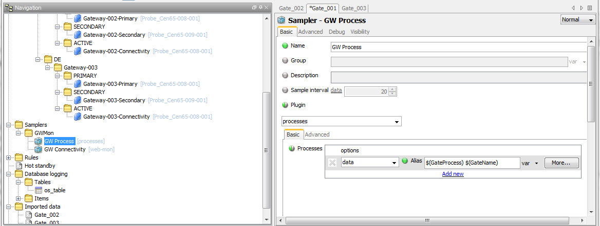

# Geneos Gateway Monitoring

## Document Controls

> Version 3.0
>
> 4<sup>th</sup> September 2014

### Revision History

Version | Author | Notes
---------|----------|---------
 1.0 | CB | First cut
 2.0 | OE | Rewritten as generic document, with Sybase support
 3.0 | RG | Redesign using gateway sharing

## Contents

<!-- TOC -->

* [Introduction](#introduction)
* [Purpose](#purpose)
* [Scope](#scope)
* [Intended Audience](#intended-audience)
* [Architecture](#architecture)
* [Monitoring Gateway Deliverables](#monitoring-gateway-deliverables)
    * [Primary Gateway Metrics](#primary-gateway-metrics)
    * [Secondary Gateway Metrics](#secondary-gateway-metrics)
    * [Active Gateway Metrics](#active-gateway-metrics)
* [Monitoring Gateway Dashboard](#monitoring-gateway-dashboard)
* [Monitored Gateway Configuration](#monitored-gateway-configuration)
    * [Netprobe configuration](#netprobe-configuration)
    * [Samplers](#samplers)
        * [Gateway Data](#gateway-data)
        * [Gateway License Usage](#gateway-license-usage)
    * [Exported Data](#exported-data)
    * [KnowledgeBase](#knowledgebase)
* [Monitoring Gateway Configuration](#monitoring-gateway-configuration)
    * [Includes](#includes)
    * [Probes](#probes)
    * [Managed Entity Groups](#managed-entity-groups)
    * [Managed Entities](#managed-entities)
    * [Sampler Groups](#sampler-groups)
    * [Samplers](#samplers)
    * [Rules](#rules)
        * [DB Connection Status](#db-connection-status)
        * [Secondary GW Connection Status](#secondary-gw-connection-status)
        * [DB Logging Enabled](#db-logging-enabled)
        * [HotStandby Enabled](#hotstandby-enabled)
        * [HotStandby Role](#hotstandby-role)
        * [License Days Remaining](#license-days-remaining)
        * [Instance Count](#instance-count)
        * [Gateway CPU](#gateway-cpu)
        * [Gateway Memory](#gateway-memory)
        * [Gateway Connection Status](#gateway-connection-status)
        * [Imported Data](#imported-data)
* [Process to add new Gateway to the monitoring gateway](#process-to-add-new-gateway-to-the-monitoring-gateway)
    * [Create the Probe](#create-the-probe)
    * [Create the Managed Entity Groups](#create-the-managed-entity-groups)
    * [Create the Managed Entities](#create-the-managed-entities)
    * [Configure Imported data](#configure-imported-data)
* [Monitored Gateway XML](#monitored-gateway-xml)
    * [Appendix A – GLOBAL_Administration.xml](#appendix-a--global_administrationxml)
    * [Appendix B – Exported data](#appendix-b--exported-data)
    * [Appendix C – Knowledge base](#appendix-c--knowledge-base)
* [Monitoring Gateway XML](#monitoring-gateway-xml)
    * [Appendix D - Gateway Setup File](#appendix-d---gateway-setup-file)

<!-- /TOC -->

## Introduction

A need has been identified to monitor the status of multiple Geneos gateway pairs, (primary & hot standby)

By this mechanism the gateways can be monitored from a single location.

The generation of a Gateway Monitoring Gateway and dashboard is a way of achieving this.

## Purpose

The purpose of this document is to describe how the Gateway Monitor Gateway can be implemented, and to describe how to add a new gateway to be monitored via this central gateway.

## Scope

This document will describe how the monitoring gateway has been configured. This document will describe how to configure an existing gateway to be monitored via the gateway monitor. This document will not describe how to update the dashboard.

This document will not describe standards and procedures.

## Intended Audience

The intended audience should be familiar with Geneos and with the installation of Geneos gateways.

## Architecture 

The monitored gateways will execute the gateway plugins `gateway data` and `gateway license`. The data views created by these plugins will be exported to the central monitoring gateway. The monitoring gateway will also need to use of a netprobe on the monitored gateway host(s) so that process metrics can be obtained.

The central monitoring gateway exhibit the monitored gateways via a stylised state tree controlled by attributes within the monitoring gateway.

The state tree will be:


Where:

* TITLE = GLOBAL
* REGION = UK / DE / US
* GROUP = Gateway-002 i.e. Gateway Name
* DATASET = Gateway-002-Active

## Monitoring Gateway Deliverables

The Gateway monitor is intended to provide a display of all Geneos Gateways globally, showing the status of both primary and secondary gateways.

### Primary Gateway Metrics

1.  Process status
2.  Memory consumption
3.  CPU consumption
4.  Connection Status

### Secondary Gateway Metrics

1.  Process status
2.  Memory consumption
3.  CPU consumption

### Active Gateway Metrics

1.  Role status (which Gateway is currently live; Primary or Secondary)
2.  DB connection status
3.  DB logging enabled status
4.  Hotstandby enabled status
5.  Hotstandby role
6.  Number of license days remaining
7.  Primary to secondary connection status

## Monitoring Gateway Dashboard


## Monitored Gateway Configuration 

The following configuration sections will be required on a gateway intended to be monitored.

The PS promoted gateway installation has all the required configuration for the gateway monitoring, the screen shots below display the include file contents:

> `GLOBAL_Adminstration.xml`

All required XML is available as appendices.

Each section is explained below.

### Netprobe configuration

A netprobe needs to be installed on the primary and secondary gateway servers. This netprobe will be used to get the gateway process, cpu and memory metrics.

### Samplers

A sampler must be configured on the gateway. This sampler is already configured if using the global Geneos PS standard:

#### Gateway Data


#### Gateway License Usage


**N.B.** If not using the global geneos standard, [Appendix A](#appendix-a-–-global_administrationxml) contains the xml required to create this sampler.

### Exported Data

Two data views created above will need to be exported from the monitored gateways :

1. GW Data

    

2. GW License

    

### KnowledgeBase

With the use of the KnowledgeBase functionality of Geneos we can determine the overall connectivity and response of the monitored gateway to external TCP connections.

The following Knowledge Base items need to be configured in each gateway to be monitored.

* KnowledgeBase

    

* Advanced

    

* Local Gateway

    

* Local Links

    

* Targets

    

* URL Elements

    

**N.B.** Ensure the paths evaluate to any Managed Entity that exists on the source Gateway. The directory kba needs to be created on the monitored gateway, the file index.html needs to exist within this directory.

The contents of index.html are not significant.

```bash
# cd ~geneos
# find . –name index.html –exec ls –l {} 
-rw-rw-r--. 1 geneos geneos 0 Sep 3 21:31 ./gateway/gateways/Gate_003/kba/index.html
```

## Monitoring Gateway Configuration 

### Includes

The Included xml file is the standard `GLOBAL_Administration.xml` this provides the virtual probe and the standard PS views, metrics and rules.


### Probes

The probes are those installed on the monitored gateway servers.


### Managed Entity Groups

The Managed Entity tree follows that prescribed in the previous Active Console settings:

* 1<sup>st</sup> Level ME Group: `Gateway-001` (Name of _Monitoring_ Gateway)
    * Attributes: TITLE = `GLOBAL`
* 2<sup>nd</sup> Level ME Group: `GWMon` (Aesthetic Separator)
* 3<sup>rd</sup> Level ME Group: `UK` (Country of _Monitored_ Gateway)
    * Attributes: REGION = `UK`
* 3<sup>rd</sup> Level ME Group = DE (Country of _Monitored_ Gateway)
    * Attributes: REGION = `DE`
* 4<sup>th</sup> Level ME Group = `Gateway-002` (Name of _Monitored_ Gateway)
    * Attributes: GROUP = `Gateway-002`
* 5<sup>th</sup> Levels:
    * ME Group = `PRIMARY` (Aesthetic Separator)
        * Attributes: DATASET = Gateway-002-Active
    * ME Group = `SECONDARY` (Aesthetic Separator)
    * ME Group = `ACTIVE` (Aesthetic Separator)

### Managed Entities

* 6<sup>th</sup> Level ME: `Gateway-002-Primary`
    
* 6<sup>th</sup> Level ME: `Gateway-002-Secondary`
    
* 6<sup>th</sup> Level ME: `Gateway-002-Connectivity`
    
    

### Sampler Groups

* 1<sup>st</sup> Level Sampler Group: `GWMon`

### Samplers

* 2<sup>nd</sup> Level Sampler: `GW Process`
    
* 2<sup>nd</sup> Level Sampler: `GW Connectivity`
    
    
    

### Rules


#### DB Connection Status


#### Secondary GW Connection Status


#### DB Logging Enabled


#### HotStandby Enabled


#### HotStandby Role


#### License Days Remaining


#### Instance Count


#### Gateway CPU


#### Gateway Memory


#### Gateway Connection Status


#### Imported Data


## Process to add new Gateway to the monitoring gateway

Once the monitored gateway has the correct data views exported and its own server probe made available the central monitoring Gateway needs to have the probes and Managed Entities added.

The process is:

1.  Create the probes
2.  Create the managed entity groups (including GROUP attribute)
3.  Create the managed entities
4.  Create the variables on the managed entities.

### Create the Probe

Create the required probes to connect to the monitored gateway’s Primary and Secondary server.

Note that if there are multiple gateways on the same host, it is not necessary to have multiple probes.

### Create the Managed Entity Groups

1.  Create a new `GROUP` attribute level `MEG` folder by copying and pasting an existing `GROUP` attribute level `MEG` folder into the correct Region folder for the source gateway, e.g. Gateway-003 into the `DE` (`REGIONAL`) folder

2.  Rename the new `GROUP` `MEG` folder to reflect the name of the source gateway to be monitored.

3.  The Group attribute should be set to the name of the gateway.

### Create the Managed Entities

1.  Rename the ME within the `PRIMARY`, `SECONDARY` and `ACTIVE MEG` folders to reflect the source gateway name followed by the `-Primary/-Secondary/-Connectivity` suffix.

2.  Ensure the 3 new MEs reference the appropriate probe.

3.  The following variables need to be created for the corresponding Managed Entity

    Variable | Type | Value
    ---------|----------|---------
    GateHost | string | Name of the Server, ensure it will be resolved
    GatePort | string | The port number the gateway is using

### Configure Imported data

Make a copy of an existing Imported data and amend it to reflect the data that is being exported from the monitored gateway.

## Monitored Gateway XML

### Appendix A – `GLOBAL_Administration.xml`

```xml
<gateway compatibility="1"
    xmlns:xsi="http://www.w3.org/2001/XMLSchema-instance" xsi:noNamespaceSchemaLocation="http://schema.itrsgroup.com/GA3.0.21-140801/gateway.xsd">
    <probes>
        <virtualProbe name="Virtual Probe"></virtualProbe>
    </probes>
    <types>
        <type name="Gateway Info">
            <sampler ref="GW Gateway Data"></sampler>
            <sampler ref="GW Client Info"></sampler>
            <sampler ref="GW Managed Entity Data"></sampler>
            <sampler ref="GW Probe Data"></sampler>
            <sampler ref="GW Severity Data"></sampler>
            <sampler ref="GW Snooze Data"></sampler>
            <sampler ref="GW User Assignment Data"></sampler>
            <sampler ref="GW Include File Data"></sampler>
            <sampler disabled="false" ref="GW License
Usage"></sampler>
        </type>
        <type name="Gateway Load">
            <!--This type will enable some plugins to monitor gateway
                load. This type is normally enabled on the virtual "<gateway name>
                Gateway" managed entity. When enabling this type for the first time also
                run one of the commands under "load monitoring/gateway/start stats
                collection" to enable the stats. These are disabled by default as there
                is a load implication for running the stats collection. -->
            <sampler ref="GW Gateway Components"></sampler>
            <sampler ref="GW Gateway Rules"></sampler>
            <sampler ref="GW Gateway Samplers"></sampler>
            <sampler ref="GW Gateway Probes"></sampler>
            <sampler ref="GW Gateway MEs"></sampler>
            <sampler ref="GW Gateway Database"></sampler>
            <sampler ref="GW Gateway XPaths"></sampler>
            <sampler ref="Gateway Totals"></sampler>
        </type>
    </types>
    <samplers>
        <samplerGroup name="Gateway Info">
            <sampler name="GW Client Info">
                <var-group>
                    <data>Gateway Info</data>
                </var-group>
                <plugin>
                    <Gateway-clientConnectionData></Gateway-clientConnectionData>
                </plugin>
                <dataviews>
                    <dataview name="GW Client Info">
                        <displayName>Client Info</displayName>
                    </dataview>
                </dataviews>
            </sampler>
            <sampler name="GW Gateway Data">
                <var-group>
                    <data>Gateway Info</data>
                </var-group>
                <plugin>
                    <Gateway-gatewayData></Gateway-gatewayData>
                </plugin>
                <dataviews>
                    <dataview name="GW Gateway Data">
                        <displayName>Gateway Data</displayName>
                    </dataview>
                </dataviews>
            </sampler>
            <sampler name="GW Include File Data">
                <var-group>
                    <data>Gateway Info</data>
                </var-group>
                <plugin>
                    <Gateway-includesData></Gateway-includesData>
                </plugin>
                <dataviews>
                    <dataview name="GW Include File Data">
                        <displayName>Include File Data</displayName>
                    </dataview>
                </dataviews>
            </sampler>
            <sampler name="GW License Usage">
                <var-group>
                    <data>Gateway Licence</data>
                </var-group>
                <plugin>
                    <Gateway-licenceUsage>
                        <groups></groups>
                    </Gateway-licenceUsage>
                </plugin>
                <dataviews>
                    <dataview name="LicenceUsage">
                        <displayName>LicenceDetails</displayName>
                    </dataview>
                    <dataview name="Overall">
                        <displayName>LicenceUsage</displayName>
                    </dataview>
                </dataviews>
            </sampler>
            <sampler name="GW Managed Entity Data">
                <var-group>
                    <data>Gateway Info</data>
                </var-group>
                <plugin>
                    <Gateway-managedEntitiesData></Gateway-managedEntitiesData>
                </plugin>
                <dataviews>
                    <dataview name="GW Managed Entity Data">
                        <displayName>Managed Entity Data</displayName>
                    </dataview>
                </dataviews>
            </sampler>
            <sampler name="GW Probe Data">
                <var-group>
                    <data>Gateway Info</data>
                </var-group>
                <plugin>
                    <Gateway-probeData></Gateway-probeData>
                </plugin>
                <dataviews>
                    <dataview name="GW Probe Data">
                        <displayName>Probe Data</displayName>
                    </dataview>
                </dataviews>
            </sampler>
            <sampler name="GW Severity Data">
                <var-group>
                    <data>Gateway Info</data>
                </var-group>
                <plugin>
                    <Gateway-severityCount></Gateway-severityCount>
                </plugin>
                <dataviews>
                    <dataview name="GW Severity Data">
                        <displayName>Severity Data</displayName>
                    </dataview>
                </dataviews>
            </sampler>
            <sampler name="GW Snooze Data">
                <var-group>
                    <data>Gateway Info</data>
                </var-group>
                <plugin>
                    <Gateway-snoozeData></Gateway-snoozeData>
                </plugin>
                <dataviews>
                    <dataview name="GW Snooze Data">
                        <displayName>Snooze Data</displayName>
                    </dataview>
                </dataviews>
            </sampler>
            <sampler name="GW User Assignment Data">
                <var-group>
                    <data>Gateway Info</data>
                </var-group>
                <plugin>
                    <Gateway-userAssignmentData></Gateway-userAssignmentData>
                </plugin>
                <dataviews>
                    <dataview name="GW User Assignment Data">
                        <displayName>User Assignment Data</displayName>
                    </dataview>
                </dataviews>
            </sampler>
        </samplerGroup>
    </samplers>
    <effects>
        <effect name="Default Email">
            <sharedLibrary>
                <libraryFile>libemail.so</libraryFile>
                <functionName>SendMail</functionName>
                <runThreaded>true</runThreaded>
                <staticParameters>
                    <staticParameter>
                        <name>_SMTP_SERVER</name>
                        <value>
                            <data>name.server.uk.lan</data>
                        </value>
                    </staticParameter>
                    <staticParameter>
                        <name>_FROM_ADDR</name>
                        <value>
                            <data>geneos@company.co.uk</data>
                        </value>
                    </staticParameter>
                    <staticParameter>
                        <name>_FROM_NAME</name>
                        <value>
                            <data>Geneos Monitoring</data>
                        </value>
                    </staticParameter>
                    <staticParameter>
                        <name>_SUBJECT</name>
                        <value>
                            <data>%(_SEVERITY) ALERT ON %(_MANAGED_ENTITY) FROM
%(_VARIABLE)</data>
                        </value>
                    </staticParameter>
                    <staticParameter>
                        <name>_ALERT_FORMAT</name>
                        <value>
                            <data>***This is an auto-generated message from Geneos
***
Server : %(_MANAGED_ENTITY)
Probe Name : %(_PROBE)
Plug-in : %(_DATAVIEW)
Hostname or IP address: %(_NETPROBE_HOST)
Severity Level: %(_SEVERITY)
Variable being monitored: %(_VARIABLE) Triggered at value:
%(_VALUE)
                            </data>
                        </value>
                    </staticParameter>
                </staticParameters>
            </sharedLibrary>
        </effect>
    </effects>
    <commands>
        <commandGroup disabled="true" name="Terminal">
            <command name="Putty Session">
                <targets>
                    <target>//managedEntity</target>
                </targets>
                <userCommand>
                    <type>script</type>
                    <runLocation>client</runLocation>
                    <args>
                        <arg>
                            <static>C:Users</static>
                        </arg>
                        <arg>
                            <concatenate>true</concatenate>
                            <xpath>/geneos/client/runtimeParameters/@Username</xpath>
                        </arg>
                        <arg>
                            <concatenate>true</concatenate>
                            <static>Desktopputty.exe -ssh</static>
                        </arg>
                        <arg>
                            <xpath>/geneos/client/runtimeParameters/@Username</xpath>
                        </arg>
                        <arg>
                            <concatenate>true</concatenate>
                            <static>@</static>
                        </arg>
                        <arg>
                            <concatenate>true</concatenate>
                            <xpath>ancestor::probe/parameters/@HostName</xpath>
                        </arg>
                    </args>
                </userCommand>
            </command>
        </commandGroup>
        <commandGroup disabled="true" name="IPCS">
            <command name="ipcrm">
                <targets>
                    <target>/geneos/gateway/directory/probe/managedEntity/sampler[(@name=&amp;quot;IPC&amp;quot;)]/dataview/rows/row/cell[(@column=&amp;quot;id&amp;quot;)]</target>
                </targets>
                <userCommand>
                    <type>script</type>
                    <runLocation>netprobe</runLocation>
                    <args>
                        <arg>
                            <static>ipcrm -m </static>
                        </arg>
                        <arg>
                            <xpath>.</xpath>
                        </arg>
                    </args>
                    <enablePassword>true</enablePassword>
                </userCommand>
            </command>
        </commandGroup>
        <commandGroup name="Geneos">
            <command name="View Configuration for Dataview">
                <targets>
                    <target>/geneos/gateway/directory/probe/managedEntity/sampler/dataview</target>
                </targets>
                <task>
                    <commands>
                        <commandRef>
                            <internalCommand>
                                <name>/PLUGIN:viewSetup</name>
                            </internalCommand>
                            <stopOnError>true</stopOnError>
                        </commandRef>
                    </commands>
                </task>
            </command>
            <command name="Restart NetProbe">
                <targets>
                    <target>/geneos/gateway/directory/probe/managedEntity</target>
                    <target>/geneos/gateway/directory/probe/managedEntity/sampler/dataview/headlines/cell[(@name=&amp;quot;samplingStatus&amp;quot;)]</target>
                </targets>
                <task>
                    <commands>
                        <commandRef>
                            <internalCommand>
                                <name>/RMS:restart</name>
                            </internalCommand>
                            <stopOnError>true</stopOnError>
                        </commandRef>
                    </commands>
                </task>
            </command>
            <command name="View Gateway Logfile">
                <targets>
                    <target>/geneos/gateway/directory</target>
                </targets>
                <userCommand>
                    <type>script</type>
                    <runLocation>gateway</runLocation>
                    <args>
                        <arg>
                            <userInput>
                                <description>Tail or Head</description>
                                <options>
                                    <option>
                                        <label>Tail</label>
                                        <value>tail</value>
                                    </option>
                                    <option>
                                        <label>Head</label>
                                        <value>head</value>
                                    </option>
                                </options>
                            </userInput>
                        </arg>
                        <arg>
                            <static>-</static>
                        </arg>
                        <arg>
                            <concatenate>true</concatenate>
                            <userInput>
                                <description>Number of Lines</description>
                                <integer>200</integer>
                            </userInput>
                        </arg>
                        <arg>
                            <xpath>//sampler[(param(&amp;quot;PluginName&amp;quot;)=&amp;quot;Gateway-gatewayData&amp;quot;)]/dataview/rows/row[(@name=&amp;quot;gatewayLogFile&amp;quot;)]/cell[(@column=&amp;quot;value&amp;quot;)]/@value</xpath>
                        </arg>
                    </args>
                </userCommand>
            </command>
        </commandGroup>
        <commandGroup name="Gateway Load">
            <command name="Gateway Load Write">
                <task>
                    <commands>
                        <commandRef>
                            <internalCommand>
                                <name>/LMSTATS:writeLMStats</name>
                            </internalCommand>
                            <stopOnError>true</stopOnError>
                        </commandRef>
                        <commandRef>
                            <internalCommand>
                                <name>/LMSTATS:resetLMStats</name>
                            </internalCommand>
                            <stopOnError>true</stopOnError>
                        </commandRef>
                    </commands>
                    <silent>true</silent>
                </task>
            </command>
        </commandGroup>
    </commands>
    <scheduledCommands>
        <scheduledCommand disabled="true" name="Reset Load Monitoring
Statistics">
            <command>
                <internalCommand>
                    <name>/LMSTATS:resetLMStats</name>
                </internalCommand>
            </command>
            <recurrence>
                <pattern>
                    <hours>
                        <everyXHours>1</everyXHours>
                    </hours>
                </pattern>
                <range>
                    <start>2013-07-30T10:28:21</start>
                    <noEndDate></noEndDate>
                </range>
            </recurrence>
        </scheduledCommand>
    </scheduledCommands>
    <rules>
        <ruleGroup name="GLOBAL Administration">
            <default name="GLOBAL Administration Default">
                <rule>
                    <priorityGroup>11000</priorityGroup>
                </rule>
            </default>
            <ruleGroup name="Gateway Plugins">
                <rule name="ProbeConnectionState">
                    <targets>
                        <target>/geneos/gateway/directory/probe/managedEntity/sampler[(@name=&amp;quot;GW Probe Data&amp;quot;)]/dataview/rows/row/cell[(@column=&amp;quot;connectionState&amp;quot;)]</target>
                    </targets>
                    <priority>1</priority>
                    <block>
                        <if>
                            <notEqual>
                                <dataItem>
                                    <property>@value</property>
                                </dataItem>
                                <string>Up</string>
                            </notEqual>
                            <transaction>
                                <delay>30</delay>
                                <update>
                                    <property>state/@severity</property>
                                    <severity>critical</severity>
                                </update>
                            </transaction>
                            <transaction>
                                <update>
                                    <property>state/@severity</property>
                                    <severity>ok</severity>
                                </update>
                            </transaction>
                        </if>
                    </block>
                </rule>
                <rule name="databaseConnectionStatus">
                    <targets>
                        <target>/geneos/gateway/directory/probe/managedEntity/sampler[(@name=&amp;quot;GW Gateway Data&amp;quot;)]/dataview/rows/row[(@name=&amp;quot;databaseConnectionStatus&amp;quot;)]/cell[(@column=&amp;quot;value&amp;quot;)]</target>
                    </targets>
                    <priority>1</priority>
                    <pathAliases>
                        <pathAlias name="DB
Enabled">ancestor::rows/row[(@name=&amp;quot;databaseLoggingEnabled&amp;quot;)]/cell[(@column=&amp;quot;value&amp;quot;)]</pathAlias>
                    </pathAliases>
                    <block>
                        <if>
                            <and>
                                <notEqual>
                                    <dataItem>
                                        <property>@value</property>
                                    </dataItem>
                                    <string>Connected</string>
                                </notEqual>
                                <like>
                                    <dataItem>
                                        <pathAlias ref="DB Enabled"></pathAlias>
                                        <property>@value</property>
                                    </dataItem>
                                    <string>true</string>
                                </like>
                            </and>
                            <transaction>
                                <update>
                                    <property>state/@severity</property>
                                    <severity>warning</severity>
                                </update>
                            </transaction>
                            <transaction>
                                <update>
                                    <property>state/@severity</property>
                                    <severity>ok</severity>
                                </update>
                            </transaction>
                        </if>
                    </block>
                </rule>
                <rule name="licenceConnection">
                    <targets>
                        <target>/geneos/gateway/directory/probe/managedEntity/sampler[(@name=&amp;quot;GW License Usage&amp;quot;)]/dataview/rows/row[(@name=&amp;quot;connected&amp;quot;)]/cell[(@column=&amp;quot;Value&amp;quot;)]</target>
                    </targets>
                    <priority>1</priority>
                    <block>
                        <if>
                            <like>
                                <dataItem>
                                    <property>@value</property>
                                </dataItem>
                                <string>YES</string>
                            </like>
                            <transaction>
                                <update>
                                    <property>state/@severity</property>
                                    <severity>ok</severity>
                                </update>
                            </transaction>
                            <transaction>
                                <update>
                                    <property>state/@severity</property>
                                    <severity>critical</severity>
                                </update>
                            </transaction>
                        </if>
                    </block>
                </rule>
                <rule name="licenceDaysRemaining">
                    <targets>
                        <target>/geneos/gateway/directory/probe/managedEntity/sampler[(@name=&amp;quot;GW License Usage&amp;quot;)]/dataview/rows/row[(@name=&amp;quot;licenseDaysRemaining&amp;quot;)]/cell[(@column=&amp;quot;Value&amp;quot;)]</target>
                        <target>/geneos/gateway/directory/probe/managedEntity/sampler[(@name=&amp;quot;GW Gateway Data&amp;quot;)]/dataview/rows/row[(@name=&amp;quot;licenseDaysRemaining&amp;quot;)]/cell[(@column=&amp;quot;value&amp;quot;)]</target>
                    </targets>
                    <priority>1</priority>
                    <block>
                        <if>
                            <lt>
                                <dataItem>
                                    <property>@value</property>
                                </dataItem>
                                <integer>5</integer>
                            </lt>
                            <transaction>
                                <update>
                                    <property>state/@severity</property>
                                    <severity>critical</severity>
                                </update>
                            </transaction>
                            <if>
                                <lt>
                                    <dataItem>
                                        <property>@value</property>
                                    </dataItem>
                                    <integer>15</integer>
                                </lt>
                                <transaction>
                                    <update>
                                        <property>state/@severity</property>
                                        <severity>warning</severity>
                                    </update>
                                </transaction>
                                <transaction>
                                    <update>
                                        <property>state/@severity</property>
                                        <severity>ok</severity>
                                    </update>
                                </transaction>
                            </if>
                        </if>
                    </block>
                </rule>
                <rule name="releaseAge">
                    <targets>
                        <target>/geneos/gateway/directory/probe/managedEntity/sampler[(@name=&amp;quot;GW Gateway Data&amp;quot;)]/dataview/rows/row[(@name=&amp;quot;releaseAge&amp;quot;)]/cell[(@column=&amp;quot;value&amp;quot;)]</target>
                        <target>/geneos/gateway/directory/probe/managedEntity/sampler[(@name=&amp;quot;GW Client Info&amp;quot;)]/dataview/rows/row/cell[(@column=&amp;quot;releaseAge&amp;quot;)]</target>
                    </targets>
                    <priority>1</priority>
                    <block>
                        <if>
                            <gt>
                                <dataItem>
                                    <property>@value</property>
                                </dataItem>
                                <integer>365</integer>
                            </gt>
                            <transaction>
                                <update>
                                    <property>state/@severity</property>
                                    <severity>critical</severity>
                                </update>
                            </transaction>
                            <if>
                                <gt>
                                    <dataItem>
                                        <property>@value</property>
                                    </dataItem>
                                    <integer>274</integer>
                                </gt>
                                <transaction>
                                    <update>
                                        <property>state/@severity</property>
                                        <severity>warning</severity>
                                    </update>
                                </transaction>
                                <transaction>
                                    <update>
                                        <property>state/@severity</property>
                                        <severity>ok</severity>
                                    </update>
                                </transaction>
                            </if>
                        </if>
                    </block>
                </rule>
                <rule name="connectionDuration">
                    <targets>
                        <target>/geneos/gateway/directory/probe/managedEntity/sampler[(@name=&amp;quot;GW Client Info&amp;quot;)]/dataview/rows/row/cell[(@column=&amp;quot;duration&amp;quot;)]</target>
                    </targets>
                    <priority>1</priority>
                    <pathAliases>
                        <pathAlias name="component">../cell[(@column=&amp;quot;component&amp;quot;)]</pathAlias>
                    </pathAliases>
                    <block>
                        <if>
                            <equal>
                                <dataItem>
                                    <pathAlias ref="component"></pathAlias>
                                    <property>@value</property>
                                </dataItem>
                                <string>GeneosWebServer</string>
                            </equal>
                            <transaction>
                                <update>
                                    <property>state/@severity</property>
                                    <severity>undefined</severity>
                                </update>
                            </transaction>
                        </if>
                        <if>
                            <gt>
                                <dataItem>
                                    <property>@value</property>
                                </dataItem>
                                <integer>7200</integer>
                            </gt>
                            <transaction>
                                <update>
                                    <property>state/@severity</property>
                                    <severity>critical</severity>
                                </update>
                            </transaction>
                            <if>
                                <gt>
                                    <dataItem>
                                        <property>@value</property>
                                    </dataItem>
                                    <integer>4320</integer>
                                </gt>
                                <transaction>
                                    <update>
                                        <property>state/@severity</property>
                                        <severity>warning</severity>
                                    </update>
                                </transaction>
                                <transaction>
                                    <update>
                                        <property>state/@severity</property>
                                        <severity>ok</severity>
                                    </update>
                                </transaction>
                            </if>
                        </if>
                    </block>
                </rule>
                <rule name="SnoozeAndUserAssignTime">
                    <targets>
                        <target>/geneos/gateway/directory/probe/managedEntity/sampler[(@name=&amp;quot;GW Snooze Data&amp;quot;)]/dataview/rows/row/cell[(@column=&amp;quot;duration&amp;quot;)]</target>
                        <target>/geneos/gateway/directory/probe/managedEntity/sampler[(@name=&amp;quot;GW
User Assignment Data&amp;quot;)]/dataview/rows/row/cell[(@column=&amp;quot;duration&amp;quot;)]</target>
                    </targets>
                    <priority>1</priority>
                    <block>
                        <if>
                            <gt>
                                <dataItem>
                                    <property>@value</property>
                                </dataItem>
                                <integer>20160</integer>
                            </gt>
                            <transaction>
                                <update>
                                    <property>state/@severity</property>
                                    <severity>critical</severity>
                                </update>
                            </transaction>
                            <if>
                                <gt>
                                    <dataItem>
                                        <property>@value</property>
                                    </dataItem>
                                    <integer>10080</integer>
                                </gt>
                                <transaction>
                                    <update>
                                        <property>state/@severity</property>
                                        <severity>warning</severity>
                                    </update>
                                </transaction>
                                <transaction>
                                    <update>
                                        <property>state/@severity</property>
                                        <severity>ok</severity>
                                    </update>
                                </transaction>
                            </if>
                        </if>
                    </block>
                </rule>
                <rule name="Max Data Age">
                    <targets>
                        <target>/geneos/gateway/directory/probe/managedEntity/sampler[(@name=&amp;quot;GW
Probe Data&amp;quot;)][(@type=&amp;quot;Gateway Info&amp;quot;)]/dataview[(@name=&amp;quot;GW Probe Data&amp;quot;)]/headlines/cell[(@name=&amp;quot;maxDataAge&amp;quot;)]</target>
                    </targets>
                    <priority>1</priority>
                    <pathAliases>
                        <pathAlias name="dataAgeLimit">../cell[(@name=&amp;quot;dataAgeLimit&amp;quot;)]</pathAlias>
                    </pathAliases>
                    <block>
                        <if>
                            <gt>
                                <dataItem>
                                    <property>@value</property>
                                </dataItem>
                                <multiply>
                                    <dataItem>
                                        <pathAlias ref="dataAgeLimit"></pathAlias>
                                        <property>@value</property>
                                    </dataItem>
                                    <double>0.75</double>
                                </multiply>
                            </gt>
                            <transaction>
                                <delay>300</delay>
                                <update>
                                    <property>state/@severity</property>
                                    <severity>critical</severity>
                                </update>
                            </transaction>
                            <if>
                                <gt>
                                    <dataItem>
                                        <property>@value</property>
                                    </dataItem>
                                    <multiply>
                                        <dataItem>
                                            <pathAlias ref="dataAgeLimit"></pathAlias>
                                            <property>@value</property>
                                        </dataItem>
                                        <double>0.50</double>
                                    </multiply>
                                </gt>
                                <transaction>
                                    <delay>300</delay>
                                    <update>
                                        <property>state/@severity</property>
                                        <severity>warning</severity>
                                    </update>
                                </transaction>
                                <transaction>
                                    <update>
                                        <property>state/@severity</property>
                                        <severity>ok</severity>
                                    </update>
                                </transaction>
                            </if>
                        </if>
                    </block>
                </rule>
                <rule name="Time Total for all MEs">
                    <targets>
                        <target>/geneos/gateway[(@name=&amp;quot;UK_LDN_FX_P01&amp;quot;)]/directory/probe[(@name=&amp;quot;Virtual Probe&amp;quot;)]/managedEntity[(@name=&amp;quot;UK_LDN_FX_P01 Gateway&amp;quot;)]/sampler[(@name=&amp;quot;Gateway Totals&amp;quot;)][(@type=&amp;quot;Gateway Load&amp;quot;)]/dataview[(@name=&amp;quot;Gateway Totals&amp;quot;)]/rows/row[(@name=&amp;quot;Value&amp;quot;)]/cell[(@column=&amp;quot;Total
Time for all MEs&amp;quot;)]</target>
                    </targets>
                    <priority>1</priority>
                    <pathAliases>
                        <pathAlias name="ME
Times">ancestor::managedEntity/sampler[(@name=&amp;quot;GW Gateway MEs&amp;quot;)][(@type=&amp;quot;Gateway Load&amp;quot;)]/dataview[(@name=&amp;quot;GW Gateway MEs&amp;quot;)]/rows/row/cell[(@column=&amp;quot;time&amp;quot;)]</pathAlias>
                    </pathAliases>
                    <block>
                        <transaction>
                            <update>
                                <property>@value</property>
                                <total>
                                    <dataItems>
                                        <pathAlias ref="ME Times"></pathAlias>
                                        <property>@value</property>
                                    </dataItems>
                                </total>
                            </update>
                        </transaction>
                    </block>
                </rule>
                <rule name="Time Total for all Rules">
                    <targets>
                        <target>/geneos/gateway[(@name=&amp;quot;UK_LDN_FX_P01&amp;quot;)]/directory/probe[(@name=&amp;quot;Virtual Probe&amp;quot;)]/managedEntity[(@name=&amp;quot;UK_LDN_FX_P01 Gateway&amp;quot;)]/sampler[(@name=&amp;quot;Gateway Totals&amp;quot;)][(@type=&amp;quot;Gateway Load&amp;quot;)]/dataview[(@name=&amp;quot;Gateway Totals&amp;quot;)]/rows/row[(@name=&amp;quot;Value&amp;quot;)]/cell[(@column=&amp;quot;Total
Time for all Rules&amp;quot;)]</target>
                    </targets>
                    <priority>1</priority>
                    <pathAliases>
                        <pathAlias name="Rule
Times">ancestor::managedEntity/sampler[(@name=&amp;quot;GW Gateway Rules&amp;quot;)][(@type=&amp;quot;Gateway Load&amp;quot;)]/dataview[(@name=&amp;quot;GW Gateway Rules&amp;quot;)]/rows/row/cell[(@column=&amp;quot;time&amp;quot;)]</pathAlias>
                    </pathAliases>
                    <block>
                        <transaction>
                            <update>
                                <property>@value</property>
                                <total>
                                    <dataItems>
                                        <pathAlias ref="Rule Times"></pathAlias>
                                        <property>@value</property>
                                    </dataItems>
                                </total>
                            </update>
                        </transaction>
                    </block>
                </rule>
                <rule name="Time Total for all XPaths">
                    <targets>
                        <target>/geneos/gateway[(@name=&amp;quot;UK_LDN_FX_P01&amp;quot;)]/directory/probe[(@name=&amp;quot;Virtual Probe&amp;quot;)]/managedEntity[(@name=&amp;quot;UK_LDN_FX_P01 Gateway&amp;quot;)]/sampler[(@name=&amp;quot;Gateway Totals&amp;quot;)][(@type=&amp;quot;Gateway Load&amp;quot;)]/dataview[(@name=&amp;quot;Gateway Totals&amp;quot;)]/rows/row[(@name=&amp;quot;Value&amp;quot;)]/cell[(@column=&amp;quot;Total
Time for all XPaths&amp;quot;)]</target>
                    </targets>
                    <priority>1</priority>
                    <pathAliases>
                        <pathAlias name="XPaths
Times">ancestor::managedEntity/sampler[(@name=&amp;quot;GW Gateway XPaths&amp;quot;)][(@type=&amp;quot;Gateway Load&amp;quot;)]/dataview[(@name=&amp;quot;GW Gateway XPaths&amp;quot;)]/rows/row/cell[(@column=&amp;quot;totalTime&amp;quot;)]</pathAlias>
                    </pathAliases>
                    <block>
                        <transaction>
                            <update>
                                <property>@value</property>
                                <total>
                                    <dataItems>
                                        <pathAlias ref="XPaths Times"></pathAlias>
                                        <property>@value</property>
                                    </dataItems>
                                </total>
                            </update>
                        </transaction>
                    </block>
                </rule>
            </ruleGroup>
            <ruleGroup name="Sampling Status">
                <rule name="Sampling Status">
                    <targets>
                        <target>/geneos/gateway/directory/probe/managedEntity/sampler/dataview/headlines/cell[(@name=&amp;quot;samplingStatus&amp;quot;)]</target>
                    </targets>
                    <priority>1</priority>
                    <block>
                        <if>
                            <or>
                                <like>
                                    <dataItem>
                                        <property>@value</property>
                                    </dataItem>
                                    <string>ok</string>
                                </like>
                                <like>
                                    <dataItem>
                                        <property>@value</property>
                                    </dataItem>
                                    <string>NOTE: Stats collection is disabled</string>
                                </like>
                            </or>
                            <transaction>
                                <update>
                                    <property>state/@severity</property>
                                    <severity>undefined</severity>
                                </update>
                            </transaction>
                            <transaction>
                                <update>
                                    <property>state/@severity</property>
                                    <severity>warning</severity>
                                </update>
                            </transaction>
                        </if>
                    </block>
                </rule>
            </ruleGroup>
        </ruleGroup>
        <ruleGroup name="GLOBAL Process">
            <rule name="Instance Count 1">
                <targets>
                    <target>/geneos/gateway/directory/probe/managedEntity/sampler[(param(&amp;quot;PluginName&amp;quot;)=&amp;quot;PROCESSES&amp;quot;)]/dataview/rows/row[not(contains(@name,&amp;quot;#&amp;quot;))]/cell[(@column=&amp;quot;instanceCount&amp;quot;)]</target>
                </targets>
                <priority>1</priority>
                <block>
                    <if>
                        <lt>
                            <dataItem>
                                <property>@value</property>
                            </dataItem>
                            <integer>1</integer>
                        </lt>
                        <transaction>
                            <update>
                                <property>state/@severity</property>
                                <severity>critical</severity>
                            </update>
                        </transaction>
                        <if>
                            <gt>
                                <dataItem>
                                    <property>@value</property>
                                </dataItem>
                                <integer>1</integer>
                            </gt>
                            <transaction>
                                <update>
                                    <property>state/@severity</property>
                                    <severity>warning</severity>
                                </update>
                            </transaction>
                            <transaction>
                                <update>
                                    <property>state/@severity</property>
                                    <severity>ok</severity>
                                </update>
                            </transaction>
                        </if>
                    </if>
                </block>
            </rule>
        </ruleGroup>
    </rules>
    <databaseLogging>
        <enabled>false</enabled>
        <tables>
            <table name="processes_table">
                <type>double</type>
            </table>
        </tables>
        <items>
            <item name="processes">
                <targets>
                    <target>/geneos/gateway/directory/probe/managedEntity/sampler[(param(&amp;quot;PluginName&amp;quot;)=&amp;quot;PROCESSES&amp;quot;)]/dataview/rows/row/cell[(@column=&amp;quot;percentCPU&amp;quot;)]</target>
                    <target>/geneos/gateway/directory/probe/managedEntity/sampler[(param(&amp;quot;PluginName&amp;quot;)=&amp;quot;PROCESSES&amp;quot;)]/dataview/rows/row/cell[(@column=&amp;quot;residentSetSize&amp;quot;)]</target>
                    <target>/geneos/gateway/directory/probe/managedEntity/sampler[(param(&amp;quot;PluginName&amp;quot;)=&amp;quot;PROCESSES&amp;quot;)]/dataview/rows/row/cell[(@column=&amp;quot;percentMemory&amp;quot;)]</target>
                    <target>/geneos/gateway/directory/probe/managedEntity/sampler[(param(&amp;quot;PluginName&amp;quot;)=&amp;quot;PROCESSES&amp;quot;)]/dataview/rows/row/cell[(@column=&amp;quot;virtualMemory&amp;quot;)]</target>
                </targets>
                <percentMargin>2.0</percentMargin>
                <table ref="processes_table"></table>
            </item>
        </items>
    </databaseLogging>
    <operatingEnvironment>
        <gatewayName></gatewayName>
        <var name="GatewayName">
            <macro>
                <gatewayName></gatewayName>
            </macro>
        </var>
        <var name="ManagedEntityName">
            <macro>
                <managedEntityName></managedEntityName>
            </macro>
        </var>
        <var name="NetprobeHost">
            <macro>
                <netprobeHost></netprobeHost>
            </macro>
        </var>
        <var name="NetprobePort">
            <macro>
                <netprobePort></netprobePort>
            </macro>
        </var>
        <var name="SamplerName">
            <macro>
                <samplerName></samplerName>
            </macro>
        </var>
        <var name="GatewayStatsFile">
            <string>gatewaystats.xml</string>
        </var>
        <writeStatsToFile>
            <filename>gatewaystats.xml</filename>
            <enablePeriodicWrite>true</enablePeriodicWrite>
            <writeInterval>300</writeInterval>
        </writeStatsToFile>
    </operatingEnvironment>
</gateway>
```

### Appendix B – Exported data

```xml
<exportedData>
    <dataSet name="GW Data">
        <paths>
            <path>/geneos/gateway[(@name=&amp;quot;Gate_002&amp;quot;)]/directory/probe[(@name=&amp;quot;Virtual Probe&amp;quot;)]/managedEntity/sampler[(param(&amp;quot;PluginName&amp;quot;)=&amp;quot;Gateway-gatewayData&amp;quot;)]</path>
        </paths>
    </dataSet>
    <dataSet name="GW License">
        <paths>
            <path>/geneos/gateway/directory/probe/managedEntity/sampler[(@name=&amp;quot;GW
License Usage&amp;quot;)]</path>
        </paths>
    </dataSet>
</exportedData>
```

### Appendix C – Knowledge base

```xml
<knowledgeBase>
    <urlTemplate name="Local Gateway">
        <urlTemplateElements>
            <urlTemplateElement>
                <literal>http://</literal>
            </urlTemplateElement>
            <urlTemplateElement>
                <xpath>ancestor::gateway/parameters/@HostName</xpath>
            </urlTemplateElement>
            <urlTemplateElement>
                <literal>:</literal>
            </urlTemplateElement>
            <urlTemplateElement>
                <xpath>ancestor::gateway/parameters/@Port</xpath>
            </urlTemplateElement>
            <urlTemplateElement>
                <literal>/knowledgeBase/</literal>
            </urlTemplateElement>
        </urlTemplateElements>
    </urlTemplate>
    <kbaSet name="Local Links">
        <kba>
            <label>General Info</label>
            <urlElements>
                <urlElement>
                    <urlTemplate ref="Local Gateway"></urlTemplate>
                </urlElement>
                <urlElement>
                    <literal>index.html</literal>
                </urlElement>
            </urlElements>
            <targets>
                <target>/geneos/gateway[(@name=&amp;quot;Gate_002&amp;quot;)]/directory/probe/managedEntity[(@name=&amp;quot;Gate_002
Gateway&amp;quot;)]</target>
            </targets>
        </kba>
    </kbaSet>
    <localServer>
        <directory>/home/geneos/gateway/gateways/Gate_002/kba</directory>
        <defaultPageName>index.html</defaultPageName>
    </localServer>
</knowledgeBase>
```

## Monitoring Gateway XML

### Appendix D - Gateway Setup File

```xml
<gateway compatibility="1"
    xmlns:xsi="http://www.w3.org/2001/XMLSchema-instance" xsi:noNamespaceSchemaLocation="http://schema.itrsgroup.com/GA3.0.21-140801/gateway.xsd">
    <includes>
        <priority>1</priority>
        <includeGroup name="Admin">
            <include>
                <priority>400</priority>
                <required>true</required>
                <location>/home/geneos/gateway/gateway_config/shared/GLOBAL_Administration.xml</location>
            </include>
        </includeGroup>
    </includes>
    <probes>
        <probe name="Probe_Cen65-008-001">
            <hostname>Cen65-008</hostname>
            <port>17036</port>
        </probe>
        <probe name="Probe_Cen65-009-001">
            <hostname>Cen65-009</hostname>
            <port>17091</port>
        </probe>
        <probe name="Probe_Gateway_001">
            <hostname>Cen65-008</hostname>
            <port>18001</port>
        </probe>
    </probes>
    <managedEntities>
        <managedEntityGroup name="Gateway-001">
            <attribute name="TITLE">GLOBAL</attribute>
            <managedEntityGroup name="GWMon">
                <managedEntityGroup name="UK">
                    <attribute name="REGION">UK</attribute>
                    <managedEntityGroup name="Gateway-002">
                        <attribute name="GROUP">Gateway-002</attribute>
                        <managedEntityGroup name="PRIMARY">
                            <var name="GateProcess">
                                <string>gateway2.linux</string>
                            </var>
                            <var name="GateName">
                                <string>Gate_002</string>
                            </var>
                            <managedEntity name="Gateway-002-Primary">
                                <probe ref="Probe_Cen65-008-001"></probe>
                                <sampler ref="GW Process"></sampler>
                            </managedEntity>
                        </managedEntityGroup>
                        <managedEntityGroup name="SECONDARY">
                            <var name="GateName">
                                <string>Gate_002_DR</string>
                            </var>
                            <var name="GateProcess">
                                <string>gateway2.linux</string>
                            </var>
                            <managedEntity name="Gateway-002-Secondary">
                                <probe ref="Probe_Cen65-009-001"></probe>
                                <sampler ref="GW Process"></sampler>
                            </managedEntity>
                        </managedEntityGroup>
                        <managedEntityGroup name="ACTIVE">
                            <attribute name="DATASET">Gateway-002-Active</attribute>
                            <managedEntity name="Gateway-002-Connectivity">
                                <probe ref="Probe_Cen65-008-001"></probe>
                                <var name="GateHost">
                                    <string>Cen65-008</string>
                                </var>
                                <var name="GatePort">
                                    <string>17052</string>
                                </var>
                                <sampler ref="GW Connectivity"></sampler>
                            </managedEntity>
                        </managedEntityGroup>
                    </managedEntityGroup>
                </managedEntityGroup>
                <managedEntityGroup name="DE">
                    <attribute name="REGION">DE</attribute>
                    <managedEntityGroup name="Gateway-003">
                        <attribute name="GROUP">Gateway-003</attribute>
                        <managedEntityGroup name="PRIMARY">
                            <var name="GateProcess">
                                <string>gateway2.linux</string>
                            </var>
                            <var name="GateName">
                                <string>Gate_003</string>
                            </var>
                            <managedEntity name="Gateway-003-Primary">
                                <probe ref="Probe_Cen65-008-001"></probe>
                                <sampler ref="GW Process"></sampler>
                            </managedEntity>
                        </managedEntityGroup>
                        <managedEntityGroup name="SECONDARY">
                            <var name="GateName">
                                <string>Gate_003_DR</string>
                            </var>
                            <var name="GateProcess">
                                <string>gateway2.linux</string>
                            </var>
                            <managedEntity name="Gateway-003-Secondary">
                                <probe ref="Probe_Cen65-009-001"></probe>
                                <sampler ref="GW Process"></sampler>
                            </managedEntity>
                        </managedEntityGroup>
                        <managedEntityGroup name="ACTIVE">
                            <attribute name="DATASET">Gateway-003-Active</attribute>
                            <managedEntity name="Gateway-003-Connectivity">
                                <probe ref="Probe_Cen65-008-001"></probe>
                                <var name="GateHost">
                                    <string>Cen65-008</string>
                                </var>
                                <var name="GatePort">
                                    <string>17053</string>
                                </var>
                                <sampler ref="GW Connectivity"></sampler>
                            </managedEntity>
                        </managedEntityGroup>
                    </managedEntityGroup>
                </managedEntityGroup>
            </managedEntityGroup>
        </managedEntityGroup>
    </managedEntities>
    <samplers>
        <samplerGroup name="GWMon">
            <sampler name="GW Process">
                <plugin>
                    <processes>
                        <processes>
                            <process>
                                <data>
                                    <alias>
                                        <var ref="GateProcess"></var>
                                        <data></data>
                                        <var ref="GateName"></var>
                                        <data></data>
                                    </alias>
                                </data>
                            </process>
                        </processes>
                    </processes>
                </plugin>
            </sampler>
            <sampler name="GW Connectivity">
                <plugin>
                    <web-mon>
                        <host>
                            <var ref="GateHost"></var>
                        </host>
                        <port>
                            <var ref="GatePort"></var>
                        </port>
                        <protocol>
                            <https></https>
                        </protocol>
                        <scenarioList>
                            <scenario>
                                <name>knowledgeBase</name>
                                <stages>
                                    <stage>
                                        <name>knowledgeBase</name>
                                        <url>
                                            <data>knowledgeBase/index.html</data>
                                        </url>
                                    </stage>
                                </stages>
                            </scenario>
                        </scenarioList>
                    </web-mon>
                </plugin>
            </sampler>
        </samplerGroup>
    </samplers>
    <rules>
        <ruleGroup name="GWMon">
            <ruleGroup name="Active GW">
                <rule name="DB Connection Status">
                    <targets>
                        <target>/geneos/gateway[(@name=&amp;quot;Gate_001&amp;quot;)]/directory/probe/managedEntity/sampler[(@name=&amp;quot;Gateway Active SQL&amp;quot;)][(@type=&amp;quot;&amp;quot;)]/dataview[(@name=&amp;quot;Status&amp;quot;)]/rows/row[(@name=&amp;quot;databaseConnectionStatus&amp;quot;)]/cell[(@column=&amp;quot;Status&amp;quot;)]</target>
                    </targets>
                    <priority>1</priority>
                    <pathVariables>
                        <pathVariable name="MEName">
                            <value>
                                <target>
                                    <managedEntityName></managedEntityName>
                                </target>
                            </value>
                        </pathVariable>
                    </pathVariables>
                    <pathAliases>
                        <pathAlias name="DataBaseEnabled">/geneos/gateway[(@name=&amp;quot;Gate_001&amp;quot;)]/directory/probe[(@name=&amp;quot;Probe_Gateway_001&amp;quot;)]/managedEntity[(@name=var(&amp;quot;MEName&amp;quot;))]/sampler[(@name=&amp;quot;Gateway Active SQL&amp;quot;)][(@type=&amp;quot;&amp;quot;)]/dataview[(@name=&amp;quot;Status&amp;quot;)]/rows/row[(@name=&amp;quot;databaseLoggingEnabled&amp;quot;)]/cell[(@column=&amp;quot;Status&amp;quot;)]</pathAlias>
                    </pathAliases>
                    <block>
                        <set>
                            <var ref="DBEnabled"></var>
                            <first>
                                <dataItems>
                                    <pathAlias ref="DataBaseEnabled"></pathAlias>
                                    <property>@value</property>
                                </dataItems>
                            </first>
                        </set>
                        <if>
                            <like>
                                <var ref="DBEnabled"></var>
                                <string>false</string>
                            </like>
                            <transaction>
                                <update>
                                    <property>state/@severity</property>
                                    <severity>ok</severity>
                                </update>
                            </transaction>
                        </if>
                        <if>
                            <like>
                                <dataItem>
                                    <property>@value</property>
                                </dataItem>
                                <string>pending</string>
                            </like>
                            <transaction>
                                <delay>60</delay>
                                <update>
                                    <property>state/@severity</property>
                                    <severity>warning</severity>
                                </update>
                            </transaction>
                            <if>
                                <unlike>
                                    <dataItem>
                                        <property>@value</property>
                                    </dataItem>
                                    <string>connected</string>
                                </unlike>
                                <transaction>
                                    <update>
                                        <property>state/@severity</property>
                                        <severity>critical</severity>
                                    </update>
                                </transaction>
                                <transaction>
                                    <update>
                                        <property>state/@severity</property>
                                        <severity>ok</severity>
                                    </update>
                                </transaction>
                            </if>
                        </if>
                    </block>
                </rule>
                <rule name="Sec GW Connection Status">
                    <targets>
                        <target>/geneos/gateway/directory/probe/managedEntity/sampler/dataview/rows/row[(@name=&amp;quot;secondaryGatewayConnectionStatus&amp;quot;)]/cell[(@column=&amp;quot;value&amp;quot;)]</target>
                    </targets>
                    <priority>1</priority>
                    <block>
                        <if>
                            <notEqual>
                                <dataItem>
                                    <property>@value</property>
                                </dataItem>
                                <string>Connected</string>
                            </notEqual>
                            <transaction>
                                <update>
                                    <property>state/@severity</property>
                                    <severity>critical</severity>
                                </update>
                            </transaction>
                            <transaction>
                                <update>
                                    <property>state/@severity</property>
                                    <severity>ok</severity>
                                </update>
                            </transaction>
                        </if>
                    </block>
                </rule>
                <rule name="DB Logging Enabled">
                    <targets>
                        <target>/geneos/gateway/directory/probe/managedEntity/sampler/dataview/rows/row[(@name=&amp;quot;databaseLoggingEnabled&amp;quot;)]/cell[(@column=&amp;quot;value&amp;quot;)]</target>
                    </targets>
                    <priority>1</priority>
                    <block>
                        <if>
                            <notEqual>
                                <dataItem>
                                    <property>@value</property>
                                </dataItem>
                                <string>true</string>
                            </notEqual>
                            <transaction>
                                <update>
                                    <property>state/@severity</property>
                                    <severity>critical</severity>
                                </update>
                            </transaction>
                            <transaction>
                                <update>
                                    <property>state/@severity</property>
                                    <severity>ok</severity>
                                </update>
                            </transaction>
                        </if>
                    </block>
                </rule>
                <rule name="HotStandby Enabled">
                    <targets>
                        <target>/geneos/gateway/directory/probe/managedEntity/sampler/dataview/rows/row[(@name=&amp;quot;hotStandbyEnabled&amp;quot;)]/cell[(@column=&amp;quot;value&amp;quot;)]</target>
                    </targets>
                    <priority>1</priority>
                    <block>
                        <if>
                            <notEqual>
                                <dataItem>
                                    <property>@value</property>
                                </dataItem>
                                <string>true</string>
                            </notEqual>
                            <transaction>
                                <update>
                                    <property>state/@severity</property>
                                    <severity>critical</severity>
                                </update>
                            </transaction>
                            <transaction>
                                <update>
                                    <property>state/@severity</property>
                                    <severity>ok</severity>
                                </update>
                            </transaction>
                        </if>
                    </block>
                </rule>
                <rule name="HotStandby Role">
                    <targets>
                        <target>/geneos/gateway/directory/probe/managedEntity/sampler/dataview/rows/row[(@name=&amp;quot;hotStandbyRole&amp;quot;)]/cell[(@column=&amp;quot;value&amp;quot;)]</target>
                    </targets>
                    <priority>1</priority>
                    <block>
                        <if>
                            <equal>
                                <dataItem>
                                    <property>@value</property>
                                </dataItem>
                                <string>Secondary</string>
                            </equal>
                            <transaction>
                                <update>
                                    <property>state/@severity</property>
                                    <severity>warning</severity>
                                </update>
                            </transaction>
                            <if>
                                <equal>
                                    <dataItem>
                                        <property>@value</property>
                                    </dataItem>
                                    <string>Primary</string>
                                </equal>
                                <transaction>
                                    <update>
                                        <property>state/@severity</property>
                                        <severity>ok</severity>
                                    </update>
                                </transaction>
                                <if>
                                    <equal>
                                        <dataItem>
                                            <property>@value</property>
                                        </dataItem>
                                        <string>Stand Alone</string>
                                    </equal>
                                    <transaction>
                                        <update>
                                            <property>state/@severity</property>
                                            <severity>warning</severity>
                                        </update>
                                    </transaction>
                                    <transaction>
                                        <update>
                                            <property>state/@severity</property>
                                            <severity>critical</severity>
                                        </update>
                                    </transaction>
                                </if>
                            </if>
                        </if>
                    </block>
                </rule>
                <rule name="License Days Remaining">
                    <targets>
                        <target>/geneos/gateway/directory/probe/managedEntity/sampler/dataview/rows/row[(@name=&amp;quot;licenseDaysRemaining&amp;quot;)]/cell[(@column=&amp;quot;Value&amp;quot;)]</target>
                    </targets>
                    <priority>1</priority>
                    <block>
                        <if>
                            <lt>
                                <dataItem>
                                    <property>@value</property>
                                </dataItem>
                                <integer>30</integer>
                            </lt>
                            <transaction>
                                <update>
                                    <property>state/@severity</property>
                                    <severity>warning</severity>
                                </update>
                            </transaction>
                            <if>
                                <lt>
                                    <dataItem>
                                        <property>@value</property>
                                    </dataItem>
                                    <integer>10</integer>
                                </lt>
                                <transaction>
                                    <update>
                                        <property>state/@severity</property>
                                        <severity>critical</severity>
                                    </update>
                                </transaction>
                                <transaction>
                                    <update>
                                        <property>state/@severity</property>
                                        <severity>ok</severity>
                                    </update>
                                </transaction>
                            </if>
                        </if>
                    </block>
                </rule>
            </ruleGroup>
            <ruleGroup name="Process">
                <rule name="InstanceCount">
                    <targets>
                        <target>/geneos/gateway/directory/probe/managedEntity[(@name=&amp;quot;Gateway Monitoring&amp;quot;)]/sampler/dataview[(@name=&amp;quot;GW Process&amp;quot;)]/rows/row[(@name=&amp;quot;gateway2&amp;quot;)]/cell[(@column=&amp;quot;instanceCount&amp;quot;)]</target>
                    </targets>
                    <priority>1</priority>
                    <block>
                        <if>
                            <equal>
                                <dataItem>
                                    <property>@value</property>
                                </dataItem>
                                <integer>0</integer>
                            </equal>
                            <transaction>
                                <update>
                                    <property>state/@severity</property>
                                    <severity>critical</severity>
                                </update>
                            </transaction>
                            <if>
                                <gt>
                                    <dataItem>
                                        <property>@value</property>
                                    </dataItem>
                                    <integer>1</integer>
                                </gt>
                                <transaction>
                                    <update>
                                        <property>state/@severity</property>
                                        <severity>warning</severity>
                                    </update>
                                </transaction>
                                <transaction>
                                    <update>
                                        <property>state/@severity</property>
                                        <severity>ok</severity>
                                    </update>
                                </transaction>
                            </if>
                        </if>
                    </block>
                </rule>
                <rule name="GW CPU">
                    <targets>
                        <target>/geneos/gateway/directory/probe/managedEntity[(@name=&amp;quot;Gateway Monitoring&amp;quot;)]/sampler/dataview[(@name=&amp;quot;GW Process&amp;quot;)]/rows/row/cell[(@column=&amp;quot;percentCPU&amp;quot;)]</target>
                    </targets>
                    <priority>1</priority>
                    <block>
                        <if>
                            <gt>
                                <dataItem>
                                    <property>@value</property>
                                </dataItem>
                                <integer>10</integer>
                            </gt>
                            <transaction>
                                <update>
                                    <property>state/@severity</property>
                                    <severity>critical</severity>
                                </update>
                            </transaction>
                            <if>
                                <gt>
                                    <dataItem>
                                        <property>@value</property>
                                    </dataItem>
                                    <integer>5</integer>
                                </gt>
                                <transaction>
                                    <update>
                                        <property>state/@severity</property>
                                        <severity>warning</severity>
                                    </update>
                                </transaction>
                                <transaction>
                                    <update>
                                        <property>state/@severity</property>
                                        <severity>ok</severity>
                                    </update>
                                </transaction>
                            </if>
                        </if>
                    </block>
                </rule>
                <rule name="GW Memory">
                    <targets>
                        <target>/geneos/gateway/directory/probe/managedEntity[(@name=&amp;quot;Gateway Monitoring&amp;quot;)]/sampler/dataview[(@name=&amp;quot;GW Process&amp;quot;)]/rows/row/cell[(@column=&amp;quot;percentMemory&amp;quot;)]</target>
                    </targets>
                    <priority>1</priority>
                    <block>
                        <if>
                            <gt>
                                <dataItem>
                                    <property>@value</property>
                                </dataItem>
                                <integer>10</integer>
                            </gt>
                            <transaction>
                                <update>
                                    <property>state/@severity</property>
                                    <severity>critical</severity>
                                </update>
                            </transaction>
                            <if>
                                <gt>
                                    <dataItem>
                                        <property>@value</property>
                                    </dataItem>
                                    <integer>5</integer>
                                </gt>
                                <transaction>
                                    <update>
                                        <property>state/@severity</property>
                                        <severity>warning</severity>
                                    </update>
                                </transaction>
                                <transaction>
                                    <update>
                                        <property>state/@severity</property>
                                        <severity>ok</severity>
                                    </update>
                                </transaction>
                            </if>
                        </if>
                    </block>
                </rule>
            </ruleGroup>
            <ruleGroup name="Webmon">
                <rule name="GW Connection Status">
                    <targets>
                        <target>/geneos/gateway/directory/probe/managedEntity/sampler[(@name=&amp;quot;GW Connectivity&amp;quot;)][(@type=&amp;quot;&amp;quot;)]/dataview[(@name=&amp;quot;GW Connectivity&amp;quot;)]/rows/row[(@name=&amp;quot;knowledgeBase&amp;quot;)]/cell[(@column=&amp;quot;status&amp;quot;)]</target>
                    </targets>
                    <priority>1</priority>
                    <block>
                        <if>
                            <notEqual>
                                <dataItem>
                                    <property>@value</property>
                                </dataItem>
                                <string>OK</string>
                            </notEqual>
                            <transaction>
                                <delay>60</delay>
                                <update>
                                    <property>state/@severity</property>
                                    <severity>critical</severity>
                                </update>
                            </transaction>
                            <transaction>
                                <update>
                                    <property>state/@severity</property>
                                    <severity>ok</severity>
                                </update>
                            </transaction>
                        </if>
                    </block>
                </rule>
            </ruleGroup>
        </ruleGroup>
    </rules>
    <hotStandby>
        <enabled>true</enabled>
        <primary>
            <hostname>Cen65-008</hostname>
            <port>17051</port>
        </primary>
        <secondary>
            <hostname>Cen65-009</hostname>
            <port>17051</port>
        </secondary>
        <syncFiles>
            <setupIncludes>true</setupIncludes>
        </syncFiles>
    </hotStandby>
    <importedData>
        <connection name="Gate_002">
            <primary>
                <hostname>Cen65-008</hostname>
                <port>17052</port>
            </primary>
            <secondary>
                <hostname>Cen65-009</hostname>
                <port>17052</port>
            </secondary>
            <authentication>
                <username>GatewayDataUser</username>
                <password>
                    <plaintext>GatewayData</plaintext>
                </password>
            </authentication>
            <prefix>GW2_</prefix>
            <attributes>
                <attribute name="TITLE">GLOBAL</attribute>
                <attribute name="REGION">UK</attribute>
                <attribute name="GROUP">Gateway-002</attribute>
                <attribute name="DATASET">Gateway-002-Active</attribute>
            </attributes>
            <dataSets>
                <dataSet>
                    <name>GW Data</name>
                </dataSet>
                <dataSet>
                    <name>GW License</name>
                </dataSet>
            </dataSets>
        </connection>
        <connection name="Gate_003">
            <primary>
                <hostname>Cen65-008</hostname>
                <port>17053</port>
            </primary>
            <secondary>
                <hostname>Cen65-009</hostname>
                <port>17053</port>
            </secondary>
            <authentication>
                <username>GatewayDataUser</username>
                <password>
                    <plaintext>GatewayData</plaintext>
                </password>
            </authentication>
            <prefix>GW3_</prefix>
            <attributes>
                <attribute name="TITLE">GLOBAL</attribute>
                <attribute name="REGION">DE</attribute>
                <attribute name="GROUP">Gateway-003</attribute>
                <attribute name="DATASET">Gateway-003-Active</attribute>
            </attributes>
            <dataSets>
                <dataSet>
                    <name>GW Data</name>
                </dataSet>
                <dataSet>
                    <name>GW License</name>
                </dataSet>
            </dataSets>
        </connection>
    </importedData>
    <operatingEnvironment>
        <gatewayName>Gate_001</gatewayName>
        <listenPort>17051</listenPort>
    </operatingEnvironment>
</gateway>
```

<script type="module">
	import mermaid from 'https://cdn.jsdelivr.net/npm/mermaid@10/dist/mermaid.esm.min.mjs';
	mermaid.initialize({
		startOnLoad: true,
		theme: 'neutral'
	});
    await mermaid.run({querySelector:'code.language-mermaid'})
</script>