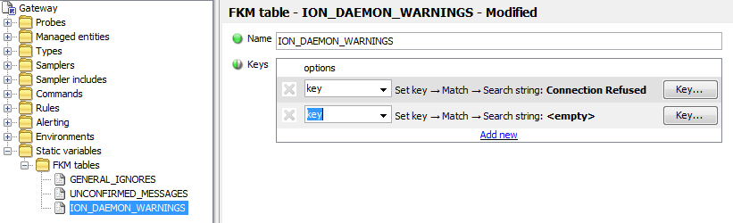
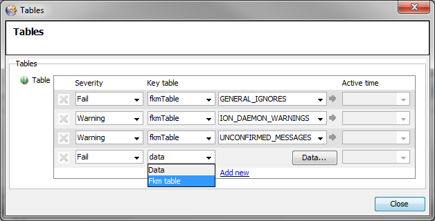

# Geneos Level 2 Monitoring Best Practice Guide

> Version 1.2
> 
> **31 July 2014**

**Document Controls**

**Revision History**

Version | Date | Author | Notes
---------|----------|---------|--------
 1.0 | 05/12/2013 | JH | First Draft
 1.1 | 08/01/2014 | JH | Revision after initial feedback
 1.2 | 31/07/2014 | JH | Copy to new company template

## Introduction

### Purpose

The purpose of this document is to provide information concerning the implementation of best practices for Level 2 Monitoring, encompassing process and log file monitoring.

### Scope

The scope of this document is restricted to details of configuration related solely to the implementation of best practices for processes and log file monitoring and does not extend to any explanation related to the general configuration of the Process or FKM Plugins.

### Audience

The intended audience for this document is any ITRS personnel or any ITRS client interested in the implementation of best practices for Level 2 monitoring.

### Background

The details in this document are the result of the accumulated experience of the Professional Services department implementing Geneos environments for many different clients and are thought to provide the most reliable solution in terms of maintenance and scalability.

## Process Monitoring

Application processes can be configured as Single Instance, Active – Passive or Active – Active processes, depending on the needs and/or requirements of the application or organisation.

The following procedures detail the way in which these differences can be accommodated within the configuration in the most straightforward manner, both for monitoring and configuration purposes.

The information contained in this section of the document relates to the best practices for *monitoring* processes. Although there is specific configuration related to this, this configuration is mostly related to Active – Passive and Active – Active processes. There is no attempt here to provide best practice for general process monitoring or configuration (i.e. use of Samplers, Sampler Includes, Process Descriptors, Variables etc.), as this will be dependent on individual requirements.

### Process Monitoring Usage

Once the process monitoring has been configured as detailed in the [Configuring Processes](#process-monitoring-configuration) the Active Console will display information differently for each process type.

#### Single Instance Processes

For Single Instance processes, the Active Console Metrics view shows the Instance Count for each process.


The default Rule for the `instanceCount` cell will set the severity of the cell to:

* `OK` if the value is equal to 1
* `Warning` if the value is greater than 1
* `Critical` if the value is less than 1

#### Active – Passive Processes

For Active – Passive processes, the Active Console Metrics view shows the Instance Count, but will additionally show the Cluster Count for each process.

For Active – Passive processes it can be expected that the Cluster Count will be either 1 or 0.


The `processName` is identical for all instances of a clustered process and this allows instances of the process to be matched across multiple servers.

Each process row contains values for the `instanceCount`, i.e. the specific process instance for the server, and the `clusterCount`, i.e. the number of instances of the particular processes that are active across all servers.

In the example above:

* The `clusterCount` is `1` and the `instanceCount` is `1` for the Primary `FX Pricer` processes and the `clusterCount` is `1` and the `instanceCount` is `0` for the Secondary `FX Pricer` processes. This is how Active – Passive processes are expected to run and the severity is set to `OK` accordingly
* The `clusterCount` is `2` and the `instanceCount` is `1` for both the Primary and the Secondary `FX Connect` processes. This is not how Active – Passive processes are expected to run and the severity is set to `Critical` accordingly
* The `clusterCount` is `1` and the `instanceCount` is `0` for the Primary `FX Options` processes and the `clusterCount` is `1` and the `instanceCount` is `1` for the Secondary `FX Options` processes. This is how Active – Passive processes are expected to run when failed over and the severity is set to `OK` accordingly

The Rule for clustered processes is not associated with the `instanceCount` column, but instead is associated with the `clusterCount` column.

For Active – Passive processes, the default Rule will set the severity of the cell to:

* `OK` if the `clusterCount` value is `1`
* `Critical` if the `clusterCount` value is not equal `1`

This allows the user to be informed in the event that both processes are down and also in the event that both processes are up.

#### Active – Active Processes

For Active – Active processes, the Active Console Metrics view shows the Instance Count, but will additionally show the Cluster Count for each process in the same manner as for the Active – Passive processes.


Each process row contains values for the `instanceCount`, i.e. the specific process instance for the server, and the `clusterCount`, i.e. the number of instances of the particular processes that are active across all servers.

In the example above:

* The `clusterCount` is `1` and the `instanceCount` is `1` for the Primary `FX Pricer` processes and the `clusterCount` is `1` and the `instanceCount` is `0` for the Secondary `FX Pricer` processes. This implies that the Active * Active processes is not running correctly. Although one of the clustered processes has failed, the application is still available, even though there might be `load` issues. To indicate that attention is needed the severity is set to `Warning`
* The `clusterCount` is `2` and the `instanceCount` is `1` for both the Primary and the Secondary `FX Connect` processes. This is how Active – Active processes are expected to run and the severity is set to `OK` accordingly
* The `clusterCount` is `0` and the `instanceCount` is `0` for both the Primary and the Secondary `FX Options` processes. This indicates that the application has failed and the severity is set to `Critical` accordingly

The Rule for clustered processes is not associated with the `instanceCount` column, but instead is associated with the `clusterCount` column.

The severity for cells is based on the value assigned to 2 variables:

* `activeActiveCritical`: the number of processes at which the severity is set to `Critical` (usually 0)
* `activeActiveOK`: the number of processes expected to exist in the cluster

The default Rule will set the severity of the cell to:

- `OK` if the `clusterCount` value is equal to the value set for the `activeActiveOK` variable

- `Warning` if the `clusterCount` value is less than the value set for the `activeActiveOK` variable

- Critical if the `clusterCount` value is equal to the value set for the `activeActiveCritical` variable

### Process Monitoring Configuration

The document will not describe how to configure individual processes, as it is expected that this information is either already known or available from other sources.

Where there are specific differences or additions to process configuration to accommodate the required type of process monitoring, these details will be included.

#### Single Instance Processes

Processes should be created in accordance with normal practice.

The default Rule for Single Instance Processes (see [Processes Rules](#_Processes_RuleS) in the Appendix section) has been configured to select `instanceCount` cells where the Managed Entity Attribute `CLUSTER TYPE` is equal to `Single` and where the Sampler is using the PROCESSES Plugin.


*N.B. If there is no requirement for clustered processes, the target for this Rule can be changed to select all `instanceCount` cells, and this would remove the requirement to perform the following action.*

To ensure that Single Instance processes use this Rule it is necessary to add a `CLUSTER TYPE` Attribute with a value of `Single` to the relevant Managed Entity Group or Managed Entity


#### Clustered Processes

If processes are not single instance processes, then they will be clustered in some way to provide resilience and/or load balancing.

Active – Passive processes are used for resilience only. In these instances there will be one process that is up and running and a second process that is inactive. If the active process fails the secondary processes will become active (this can be either manual or automatic and is not relevant to the monitoring of the cluster).

There should therefore only ever be one process of an Active – Passive pair active at any time and the monitoring is configured to reflect this.

*N.B. Active - Passive processes are not `clustered` in the technical sense of the term, but can be considered `clustered` in terms of the way in which the processes are monitored here.*

Active – Active processes are used for resilience and load balancing. In these instances there can be any number of processes in the cluster. All processes are active and the application is available through any one of the instances. When one of the processes fails the application is still available, although the connections to the application will be reduced and the consequent load on the remaining instances will be increased.

The monitoring for Active – Active processes is configured to reflect the number of processes in any cluster and also the number at which a `Critical` alert should be raised. By default, a `Warning` alert is raised if the number of processes drops below the number of processes in the cluster, but this can be changed to be any required number.

##### Clustered Processes Rule

The Rule that calculates the number of processes in a cluster is called `Cluster Count` and has a target of any cell in the `clusterCount` column where the row name is not equal to `*#*`, i.e. all Summary information rows.


The Rule will add up the values of all of the `instanceCount` cells where the Row Name is the same as the target `$rowName` and the Type for the Process is the same as the target `$samplerType`.


The Path for the `Path alias` looks as follows:


N.B. There are two important factors relating to this configuration:

1.  The use of the target for the `Cluster Count` Rule implies that the Process Sampler has been set to show `Summary` information (this should normally be the case otherwise the instanceCount column would not be available for the underlying processes)
2.  The use of the `total` function in the Rule implies that `Compute Engine` is included in the licence for the client. If this is not the case, then it would not be possible to configure monitoring for clustered processes in this manner.

##### Clustered Processes Sampler

The above Rule has a target of the `clusterCount` column. This column does not exist by default in the Processes Sampler configuration and must be added for both Active – Passive and Active – Active processes.

To add the column it is necessary to:

1.  Configure the relevant Processes Sampler to have a `clusterCount` Column, by setting the `Additions` options in the `Dataviews` section of the Advanced tab settings

    

2.  The `Additions` setting should contain a single setting for the `clusterCount` Column, as follows:

    

It is also necessary to configure each process within the cluster to have the same name. The best way to achieve this it to ensure that the same Sampler configuration is used for both Managed Entities:


##### Active – Passive Processes

Processes should be created in accordance with normal practice and the additional cluster procedures outlined in [Clustered Processes Rule](#clustered-processes-rule) and [Clustered Processes Sampler](#clustered-processes-sampler) above.

The default Rule for Active – Passive Processes (see [Processes Rules](#processes-rules) in the Appendix section) has been configured to select `clusterCount` cells where the Managed Entity Attribute `CLUSTER TYPE` is equal to `ActivePassive` and where the Sampler is using the `PROCESSES` Plugin.


To ensure that Active - Passive processes use this Rule it is necessary to add a `CLUSTER TYPE` Attribute with a value of `activePassive` to the relevant Managed Entity Group or Managed Entity


##### Active – Active Processes

Processes should be created in accordance with normal practice and the additional cluster procedures outlined above in [Clustered Processes Rule](#clustered-processes-rule) and [Clustered Processes Sampler](#clustered-processes-sampler).

The default Rule for Active – Active Processes (see [Processes Rules](#processes-rules) in the Appendix section) has been configured to select `clusterCount` cells where the Managed Entity Attribute `CLUSTER TYPE` is equal to `ActiveActive` and where the Sampler is using the `PROCESSES` Plugin.

The Rule checks the cell value against the value of one of two Variables; `activeActiveCritical` or `activeActiveOK`.


For this Rule to work for Active – Active processes it is necessary to assign values to the relevant Variables, as follows:

1.  Assign the appropriate values to the `activeActiveCritical` and `activeActiveOK` Variables

    

2.  Assign the Environment to the relevant Managed Entities

    

    **N.B.** An `Environment` should only be added to the `Add types` Section of a Managed Entity Group if it is certain that all Managed Entities belonging to the group will use these Variable settings. Variables placed here cannot be overwritten and in all other instances the Environment must be added to the `Environment` section in the Advanced Tab of the individual Managed Entities.

3.  If the `Warning` alert is required when the number of processes in the cluster reaches a value other than one less than the number of processes in the cluster, then the warning transaction in the Rule should be changed so that it uses a different Variable (e.g. `$activeActiveWarning`) and the additional Variable added to the list of Variable in the Environment in Step 1 above

To ensure that Active - Active processes use this Rule it is necessary to add a `CLUSTER TYPE` Attribute with a value of `ActiveActive` to the relevant Managed Entity Group or Managed Entity


##### Adding a different Cluster setting to a Row

Using the `CLUSTER TYPE` Attribute it is possible for different Managed Entities within the same Managed Entity Group to be configured to display different cluster types.

However, it is not possible to use the `CLUSTER TYPE` Attribute where there is a requirement to have different processes within the same Managed Entity display different cluster types.

To enable this, the following procedure should be followed:

1.  Check the priority of the `Active Active` and `Active Passive` Rules - The Rule with the highest priority (lowest number) is the Cluster Type that must be used at Row level

2.  Ensure that the Cluster Type with the lower priority Rule is set as the `CLUSTER TYPE` Attribute for the Managed Entity (if this makes administration difficult it might be easier to create a separate Managed Entity for the different cluster process)

3.  Add the relevant Row(s) for the Cluster Type with the higher priority as separate Targets in the relevant `Active Active` or `Active Passive` Rules. For instance; to set the `FX Pricer` process to Active – Passive, add the target for that process to the `ActivePassive` Rule:

    

4.  Check that the output is displaying correctly for the individual rows:

    
    

**N.B.** This procedure can also be followed to add a `Single` Cluster Type to an individual Row within a Managed Entity that already uses either the `Active Active` Rule or the `Active Passive` Rule. However, it will also be necessary to additionally create a separate Rule to set the Severity to Undefined for the `clusterCount` column of the process

## Log File Monitoring

The FKM plugin is one of the key elements within Geneos to provide application monitoring.

The functionality of the plugin is extremely flexible and versatile to accommodate a wide variety of use case scenarios. Although this is useful, it often leaves clients with a basic configuration that is unsuited to the continuous improvement necessary to provide the most efficient monitoring over time.

These Best Practices have been developed to encourage the continuous improvement of log file monitoring.

### Log File Monitoring Usage

Once the Log File monitoring has been configured as detailed in the [Log File General Configuration](#general-configuration) section and has been running long enough for some initial changes to be made, as described in the [Fine-Tuning Log File Monitoring](#fine-tuning-log-file-monitoring) section, the output for a specific log file might look similar to the following:


A row is displayed each time a specified keyword is encountered in any line within the monitored file.

The rows are grouped by the keyword that has been encountered in the file. The `triggerCount` column indicates the number of times a particular keyword has been encountered within the file since the last time the trigger was `cleared` or the file `accepted`. As well as showing how often a message has been detected, this also helps the user to decide how relevant a particular message might be.

The FKM Sampler has been configured in such a way that an indicative message is both appended to the row name and pre-pended to the `triggerDetails` cell.

The example shows that there have been 3 `Garbage Collector..` errors, 483 `License Errors`, 2 `Memory 70%` errors and 2 `Unconfirmed Errors`.

Use the `Show Tables` option from the right-click menu for a file to see what keywords are being search for within the file.


This will show something similar to the following:


* Keys with a severity of `Ignore` result in the entire line being discarded from further searches if the key is encountered
* Tables can be either `Failed` or `Warning`
* UPPERCASE keys indicate a case-insensitive search. The entry `(Regex)` at the end of a key indicates a case-sensitive Regex search
* The `Severity` of a key within a specific table can be set independently so as to be different from the severity of the table if required
* The value after `Message:` indicates the text that is appended to the row name and prepended to the triggerDetails cell value

Use the `View File Near this Trigger` from the right-click menu for a trigger to investigate a specific keyword


This will display the line containing the keyword encountered highlighted in blue, together with a section of log file both before and after the event.


The messages for `Memory 70%` etc. in the FKM DataView indicate that the keyword search has been configured for specific error messages.

All messages found for these specific keyword searches should be from the same source event. The `Message text` should indicate this, allowing the user to understand the situation more clearly, reducing the time taken to investigate and clear the event.

The `Unconfirmed Errors` (or `Unconfirmed Failures` and `Unconfirmed Aborts`) row shows the messages discovered that contain non-specific keyword searches, such as the word `error`, `fail` or `abort`, that will result in matches for messages from potentially very different events.

Continuous improvement relies on being able to sort these `Unconfirmed` messages into messages that can be either ignored or messages that should be monitored.

It is therefore important to be able to see what the actual messages are for these `Unconfirmed Errors` and to decide whether each specific message should be ignored or configured as a separate key.

Use the `Trigger Details` option from the right-click menu for a trigger (in this case the `Unconfirmed Errors` trigger) to display all of the keys that have been encountered for the key.


This will display all of the separate triggers for the `Unconfirmed Error` keyword in question (this is the keyword `ERROR` as shown by the `Show Tables` output).

Using the `Find...` option from the right-click menu for the Output window, it is then possible to search for all occurrences of the word `Error` in the output, , and decide how the individual messages should be handled.


In this example, the first message seems to be an information message and the various occurrences of `Error...`` relate to a non-error state.

The most suitable non-error indicator should be added to the `<APP>_IGNORE` table, or the `GENERAL_IGNORE` table if it is thought that the format can be used to ignore similar messages for other applications as well

* In the second message, `Error Type 6` should probably not be used as
it might also relate to different events
* The phrase `Error Bad connection status between ...` should be used to create a separate trigger for this event and placed in the `<APP>_WARNING` table

In this manner, the number of matches from the `Unconfirmed Error` keyword should reduce and the number of meaningful, relevant messages should increase.

### Log File Monitoring Best Practices

The purpose of the above configuration is to aid the creation of a system that monitors application log files for pertinent events only and which allows the user to become pro-active in their response to events.

This should reduce the number of application and system outages and so increase the availability and stability of applications.

It should be taken as a matter of good practice to only configure a message with a FKM Severity of `Fail` if the message indicates an actual system or application failure.

All other message events should be set to an FKM Severity of `Warning` (or `Ignore`).

In order to fine tune the log file monitoring the following procedures should be followed:

* Check the contents of the `Unconfirmed Error` messages as soon as messages appear
* Configure `Unconfirmed Error` messages as:
  * Ignore Keys
  * Warning Keys
  * Failed Keys (only for system or application failures)
* Check relevance of configured messages:
  * How frequent are messages?
  * How well do messages relate to actual events, i.e. is it possible to tell from a message what event has taken place?
* For in-house applications; feedback information to development teams to:
  * Reduce message numbers
  * Increase message relevance
* For 3<sup>rd</sup>-Party applications:
  * If frequent/non-relevant messages are not affecting application behaviour – Ignore
  * If frequent/non-relevant messages are affecting application behaviour – see if fine-tuning is possible, and/or feedback information to 3<sup>rd</sup> party to improve the application behaviour

Once the initial fine-tuning stage has been completed there should be no (or very infrequent) `Unconfirmed Error` messages (please note that this is a gradual process that can take up to 3 months or more to complete, depending on how much time can be allocated to this work).

After this time there might be a large number of entries in the various `IGNORE` tables and this has the potential to degrade the performance of the FKM Plugin.

It is possible at this point to remove the `Unconfirmed Error`, `Unconfirmed Abort` and `Unconfirmed Fail` keys (i.e. the `UNCONFIRMED_MESSAGES` FKM Table can be removed from all Sampler configuration). This will allow all of the IGNORE keys (that contained those key words) to also be deleted and so improve the performance of the FKM Plugin.

The disadvantage of doing this is that any message that has previously not been encountered that contains one of the general `Unconfirmed` message keys will not get picked up by the system.

For these errors, the support team initially become re-active as they can only enter the new message once it has become apparent through the behaviour of the system or application.

It is up to the application support team to decide between the relative merits of the performance of the FKM plugin over the number of potential events to which they might become re-active.

#### Dealing With Issues During Initial Improvement Process

It has already been stated that the fine-tuning stage can take a number of months to complete.

During this time it is likely that the FKM DataViews and the Managed Entities to which they belong will be constantly at a `Warning` severity. This will be due to the high number of:

* Unconfirmed messages that haven`t yet been sorted
* Messages that have been sorted, but which are in an investigation stage, such as the multiple `Licence Error` messages in the above example

While this state continues, any system or application failure messages with an FKM Severity of `Fail` will be spotted immediately as the Severity of the DataView and Managed Entity will change to `Critical`.

However, in cases where it is not possible to continually check the status of the FKM alerts, it will be difficult to spot occurrences of confirmed messages with an FKM Severity of `Warning`, as these will be masked by the continuous `Warning` state of the DataView and Managed Entity.

If this is likely to be the case it is advised to perform the following in order that these messages can be spotted during the fine-tuning phase:

1. Only place confirmed non-system and application failure messages in the `<APP_WARNING>` table where it is known that an action is required
2. Set the severity of the `<APP_WARNING>` table to `Fail` in the relevant FKM sampler during the initial fine-tuning phase
3. Place confirmed message that require investigation into a separate `<APP_INVESTIGATE>` table
4. Set the Severity of the `<APP_INVESTIGATE>` table to `Warning` in the relevant FKM Sampler
5. Once all messages have been moved out of the `<APP_INVESTIGATE>` table and the initial fine-tuning stage is completed, change the severity of the `<APP_WARNING>` table to `Warning` in the relevant FKM sampler

### Log File Monitoring Configuration

#### General Configuration

Each instance of an FKM Sampler should have the same base configuration.

The configuration for this is in the advanced tab of each FKM Sampler and it is important to remember to use this configuration whenever new FKM Samplers are created:


For each new log file that is configured, ensure that the following, minimum Table definitions are set:


The `GENERAL_IGNORES` Table can initially be empty.

The `UNCONFIRMED_MESSAGES` should contain entries for any general
keywords required, such as:


Each key should have configuration similar to the following:


* The general message match key
* The Message text
* Hardcoded severity set to `warning` in case the Table is accidentally set with a `Failed` severity within the FKM Sampler definition

It might also be considered to initially set a `Clear Time` on the file as there can potentially be thousands of `Unconfirmed` messages.


These can be removed once some initial message management has taken place.

#### Fine-Tuning Log File Monitoring


Whenever `Unconfirmed Errors` (or `Abort` and `Fails`) appear, these should be investigated to decide whether the message can be ignored or need to be created as individual keys.

Messages should not be left to reappear as `Unconfirmed Errors` (or `Abort` and `Fails`).

As detailed in the [Usage](#log-file-monitoring-usage) section above, the `Trigger Details` option can be used to discover the different triggers for each occurrence of the relevant keyword.

Each separate occurrence should then be created as either an `ignore` key or as a separate alert key.

It also needs to be decided whether an `ignore` key is added to the `GENERAL_IGNORE` table or to a separate `<APPLICATION>_IGNORE` table, remembering that too many entries in the `GENERAL_IGNORE` table can have a detrimental effect on the performance of the FKM Plugin.

To add a new Ignore Key to an existing `IGNORE` Table, perform the following:

1. Add a new Key line and select `Ignore Key` from the drop-down list

    

2. Add the Ignore Key details as required, ensuring to select `Basic` from the `Rules` drop-down list where the key include Regex characters that are not to be treated as such, but are to treated as text

    

3. Save the configuration

To add a new Key to an existing `WARNING` or `FAIL` Table, perform the following:

1.  Add a new Key line and select `Ignore Key` from the drop-down list

    

2.  Add the Key details and the Message details as required, ensuring to select the relevant option from the `Rules` dropdown list as required

    

3.  Save the configuration

If there is no `<APP>_WARNINGS`, `<APP>_FAIL`, or `<APP>_IGNORES` Tables and the configuration requires these to be created, perform the following:

1. Create the required Table

    

2. Create the required keys as described above

3. Add the Table to the relevant FKM Sampler or Sampler Include file

   1.  Select Severity `Warning` for WARNING Tables and Severity `Fail` for FAIL and IGNORE Tables

        

    2. Select Key table type `fkmTable`

        

    3. Select the required FKM Table

        

    4. Ensure that the Table order is correct by using the right-click `Move row up` or `Move row to top` options to re-order any Tables

        

        The ordering of the Tables should be as follows:

        * `<APP>_IGNORES`
        * `GENERAL_IGNORES`
        * `<APP>_FAILS`
        * `<APP>_WARNINGS`
        * `UNCONFIRMED_MESSAGES`

        

4. Ensure that the Table is added to all log files for the application

5. Save the configuration

## Appendix

### Process Configuration

#### Processes Rules

```xml
<ruleGroup name="Processes">
    <ruleGroup name="Cluster">
        <rule name="Active Active">
            <targets>
                <target>/geneos/gateway/directory/probe/managedEntity[(attr(&quot;CLUSTER TYPE&quot;)=&quot;ActiveActive&quot;)]/sampler[(param(&quot;PluginName&quot;)=&quot;PROCESSES&quot;)]/dataview/rows/row/cell[(@column=&quot;clusterCount&quot;)]</target>
            </targets>
            <priority>20</priority>
            <evaluateOnDataviewSample>true</evaluateOnDataviewSample>
            <block>
                <if>
                    <equal>
                        <dataItem>
                            <property>@value</property>
                        </dataItem>
                        <var ref="activeActiveCritical"></var>
                    </equal>
                    <transaction>
                        <update>
                            <property>state/@severity</property>
                            <severity>critical</severity>
                        </update>
                    </transaction>
                    <if>
                        <equal>
                            <dataItem>
                                <property>@value</property>
                            </dataItem>
                            <var ref="activeActiveOK"></var>
                        </equal>
                        <transaction>
                            <update>
                                <property>state/@severity</property>
                                <severity>ok</severity>
                            </update>
                        </transaction>
                        <if>
                            <lt>
                                <dataItem>
                                    <property>@value</property>
                                </dataItem>
                                <var ref="activeActiveOK"></var>
                            </lt>
                            <transaction>
                                <update>
                                    <property>state/@severity</property>
                                    <severity>warning</severity>
                                </update>
                            </transaction>
                        </if>
                    </if>
                </if>
            </block>
        </rule>
        <rule name="Active Passive">
            <targets>
                <target>/geneos/gateway/directory/probe/managedEntity[(attr(&quot;CLUSTER TYPE&quot;)=&quot;ActivePassive&quot;)]/sampler[(param(&quot;PluginName&quot;)=&quot;PROCESSES&quot;)]/dataview/rows/row/cell[(@column=&quot;clusterCount&quot;)]</target>
            </targets>
            <priority>10</priority>
            <block>
                <if>
                    <equal>
                        <dataItem>
                            <property>@value</property>
                        </dataItem>
                        <integer>1</integer>
                    </equal>
                    <transaction>
                        <update>
                            <property>state/@severity</property>
                            <severity>ok</severity>
                        </update>
                    </transaction>
                    <transaction>
                        <update>
                            <property>state/@severity</property>
                            <severity>critical</severity>
                        </update>
                    </transaction>
                </if>
            </block>
        </rule>
        <rule name="Cluster Count">
            <target>
                <target>/geneos/gateway/directory/probe/managedEntity/sampler[(param(&quot;PluginName&quot;)=&quot;PROCESSES&quot;)]/dataview/rows/row[not(contains(@name,&quot;#&quot;))]/cell[(@column=&quot;clusterCount&quot;)]</target>
            </targets>
            <priority>100</priority>
            <pathVariables>
                <pathVariable name="Type">
                    <value>
                        <target>
                            <samplerType></samplerType>
                        </target>
                    </value>
                </pathVariable>
                <pathVariable name="Row">
                    <value>
                        <target>
                            <rowName></rowName>
                        </target>
                    </value>
                </pathVariable>
            </pathVariables>
            <pathAliases>
                <pathAlias name="Cluster
Rows">/geneos/gateway/directory/probe/managedEntity/sampler[(@type=var(&quot;Type&quot;))][(param(&quot;PluginName&quot;)=&quot;PROCESSES&quot;)]/dataview/rows/row[(@name=var(&quot;Row&quot;))]/cell[(@column=&quot;instanceCount&quot;)]</pathAlias>
            </pathAliases>
            <evaluateOnDataviewSample>true</evaluateOnDataviewSample>
            <block>
                <transaction>
                    <update>
                        <property>@value</property>
                        <total>
                            <dataItems>
                                <pathAlias ref="Cluster Rows"></pathAlias>
                                <property>@value</property>
                            </dataItems>
                        </total>
                    </update>
                </transaction>
            </block>
        </rule>
    </ruleGroup>
    <ruleGroup name="Standard">
        <rule name="Instance Count 1">
            <targets>
                <target>/geneos/gateway/directory/probe/managedEntity[(attr(&quot;CLUSTER TYPE&quot;)=&quot;Single&quot;)]/sampler[(param(&quot;PluginName&quot;)=&quot;PROCESSES&quot;)]/dataview/rows/row[not(contains(@name,&quot;#&quot;))]/cell[(@column=&quot;instanceCount&quot;)]</target>
            </targets>
            <priority>1</priority>
            <block>
                <if>
                    <lt>
                        <dataItem>
                            <property>@value</property>
                        </dataItem>
                        <integer>1</integer>
                    </lt>
                    <transaction>
                        <update>
                            <property>state/@severity</property>
                            <severity>critical</severity>
                        </update>
                    </transaction>
                    <if>
                        <gt>
                            <dataItem>
                                <property>@value</property>
                            </dataItem>
                            <integer>1</integer>
                        </gt>
                        <transaction>
                            <update>
                                <property>state/@severity</property>
                                <severity>warning</severity>
                            </update>
                        </transaction>
                        <transaction>
                            <update>
                                <property>state/@severity</property>
                                <severity>ok</severity>
                            </update>
                        </transaction>
                    </if>
                </if>
            </block>
        </rule>
    </ruleGroup>
</ruleGroup>
```

<script type="module">
	import mermaid from 'https://cdn.jsdelivr.net/npm/mermaid@10/dist/mermaid.esm.min.mjs';
	mermaid.initialize({
		startOnLoad: true,
		theme: 'neutral'
	});
    await mermaid.run({querySelector:'code.language-mermaid'})

</script>
